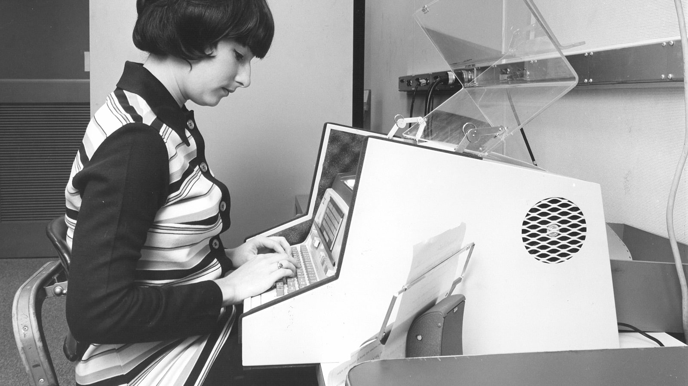

# o

> Photo: [Nokia Bell Labs](https://www.nokia.com/bell-labs/), UNIX 86.

A [monorepo](https://en.wikipedia.org/wiki/Monorepo) of [Observability](https://opentelemetry.io/docs/concepts/observability-primer/) and [Kubernetes](https://github.com/kubernetes/kubernetes) operation addons. [Go](https://github.com/golang/go) [1.27.0](https://github.com/golang/go/releases/tag/go1.27.0) is the primary runtime, with [Rust](https://github.com/rust-lang/rust) [1.98+](https://github.com/rust-lang/rust/releases/tag/1.98.0) used for the CLI tools and several addons. Includes CLI [tools](./box/tools/), [kubernetes](./box/kubernetes/) addons, [kubernetes operators](https://kubernetes.io/docs/concepts/extend-kubernetes/operator/), runtime images, and [notes](./notes/).

## Design

### Monorepo

This repository follows the single-repository model Google describes in [Why Google Stores Billions of Lines of Code in a Single Repository](https://cacm.acm.org/research/why-google-stores-billions-of-lines-of-code-in-a-single-repository/) (CACM, 2016). The same trade-offs apply at this smaller scale: unified versioning with a single source of truth avoids cross-repo version skew, shared conventions (Makefiles, CI workflows, release pipelines) can be updated atomically in one commit, all tools and addons stay discoverable in one place to encourage reuse over duplicated boilerplate, and a new tool starts as a directory rather than a new repository with its own CI, permissions, and release setup to bootstrap. It also suits AI-assisted development: a single checkout gives coding agents full cross-project context in one place, so they can trace shared conventions, reuse existing patterns, and make atomic changes across tools without juggling multiple repositories.

## License

This repository is licensed under the Apache License 2.0. See the [LICENSE](./LICENSE) file for details.
