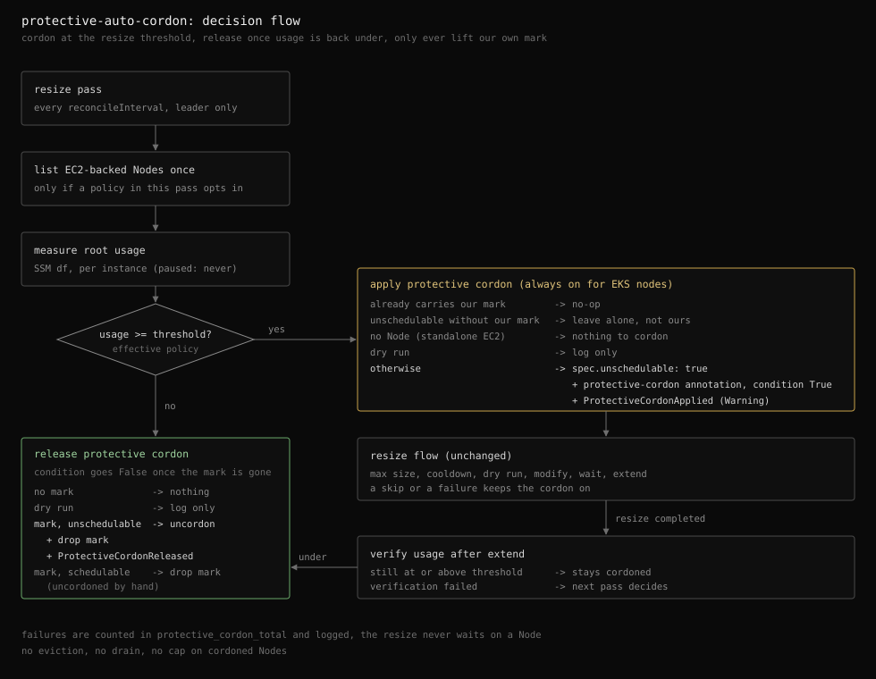

# Protective auto-cordon

| Status | Category |
| --- | --- |
| implemented (always on for EKS nodes, no switch) | reliability |

The resize loop grows a root volume once its filesystem crosses a usage threshold. On an in-cluster Kubernetes [Node][k8s-node] the [scheduler][k8s-scheduler] keeps placing [Pods][k8s-pod] on that disk while it grows, and keeps doing so when the volume cannot grow at all. This design [cordons][k8s-cordon] such a Node for as long as its disk is over the threshold, as a protective measure for scheduling, and lifts the cordon automatically once the disk has room again.



## The problem

A resize is not instant. Between the measurement that crosses the threshold and the extended filesystem sit an SSM round trip, `ModifyVolume`, the wait for `optimizing`, and `growpart` with `resize2fs`, which together take minutes. Two guards can also stop the resize entirely: the 6-hour EBS modification cooldown and `maxVolumeSizeGiB`. In those cases the disk keeps filling with no relief coming.

On an EKS node the root filesystem holds the container runtime's image store, container writable layers, [emptyDir][k8s-emptydir] volumes, and logs. Every new Pod scheduled there pulls images and writes to the same disk that is already running out.

The [kubelet][k8s-kubelet]'s own defense comes late and hurts. It reports [`DiskPressure`][k8s-node-conditions] only at its [eviction][k8s-eviction] threshold (`nodefs.available<10%` and `imagefs.available<15%` by default), [taints][k8s-taint] the Node [`node.kubernetes.io/disk-pressure`][k8s-taint-disk-pressure], and then evicts running Pods to reclaim space. The protective cordon acts earlier, at the resize threshold the operator already chose, and only stops new placements. Nothing running is touched.

## Why cordon

- **A cordon, not a [drain][k8s-drain].** The disk problem is solved by growing the volume, not by moving workloads. A drain evicts running Pods, interacts with [PodDisruptionBudgets][k8s-pdb], and turns a capacity warning into a disruption. The cordon only closes the door to new Pods.
- **A cordon, not a custom taint.** `spec.unschedulable` is what every operator and tool already understands: `kubectl get nodes` shows `SchedulingDisabled`, [`kubectl uncordon`][k8s-kubectl-uncordon] reverses it, and [cluster autoscalers][k8s-node-autoscaling] treat it as not accepting Pods. A custom `NoSchedule` taint would filter the same Pods but stay invisible in the Node list and need its own runbook.
- **[DaemonSets][k8s-daemonset] keep working.** A cordoned Node carries the [`node.kubernetes.io/unschedulable:NoSchedule`][k8s-taint-unschedulable] taint, which DaemonSet Pods tolerate by default, so node agents (CNI, log shippers, exporters) are unaffected.

## Ownership: the annotation mark

The cordon state of a Node is shared with operators, drains, Karpenter, and other controllers. The addon must never lift a cordon it did not apply, so it marks its own:

- **Cordon** sets `spec.unschedulable: true` and the `external-ebs-autoresizer/protective-cordon` [annotation][k8s-annotations], whose value is the RFC 3339 instant of the cordon, in one [merge patch][k8s-merge-patch]. The control plane then adds the `node.kubernetes.io/unschedulable` taint, so a protectively cordoned Node looks like this:

  ```yaml
  apiVersion: v1
  kind: Node
  metadata:
    name: ip-10-0-1-5.ap-northeast-2.compute.internal
    annotations:
      external-ebs-autoresizer/protective-cordon: "2026-10-09T01:20:00Z"
  spec:
    providerID: aws:///ap-northeast-2a/i-0123456789abcdef0
    unschedulable: true
    taints:
      - key: node.kubernetes.io/unschedulable
        effect: NoSchedule
        timeAdded: "2026-10-09T01:20:00Z"
  ```
- **Release** removes both in one merge patch, and only on a Node that carries the mark.
- **A Node already unschedulable without the mark** belongs to someone else. The addon does not cordon it (there is nothing to add) and so never marks it, which means it never later uncordons it.
- **A Node with the mark that is already schedulable** was uncordoned by hand. The addon drops the mark and records no [Event][k8s-events].

### The `ProtectiveCordon` condition

The annotation is precise but hidden: `kubectl describe node` buries it among dozens of annotations, and nothing outside the addon reads it. The mark is therefore mirrored as a custom [Node condition][k8s-node-conditions] of type `ProtectiveCordon`, which shows next to `Ready` and `DiskPressure`, carries a reason and a message, and is queryable with a JSONPath filter.

Node conditions are not reserved for the kubelet. Any component with `patch` on `nodes/status` can own a condition type: CNI plugins such as [Calico][calico] and [Cilium][cilium] report `NetworkUnavailable`, and [node-problem-detector][npd] adds types such as `KernelDeadlock` and `ReadonlyFilesystem`. Each type has exactly one writer, and `ProtectiveCordon` is written only by this addon.

- **`True`** with reason `ProtectiveCordonApplied` while the addon holds the cordon.
- **`False`** once it no longer does, with a reason that says who ended it. Reason changes with status, as it does for every condition owner:
  - `ProtectiveCordonReleased` when the Node is schedulable again with usage back under the threshold, after the addon's own uncordon or a manual one.
  - `ProtectiveCordonMarkRemoved` when someone else removed the mark, typically an operator taking over the cordon for maintenance while the Node stays unschedulable.
- **Fixed messages** per reason with no usage figures, named after the writer the way `kubelet has no disk pressure` and `Calico is running on this node` are. The condition states the current fact, while the usage that triggered a change lives in the Node Events and the usage metric.
- **Absent** on Nodes the addon never cordoned. Writing `False` on every Node would cost one status write per Node for no information.

The annotation stays the source of truth for ownership and the condition follows it. After every cordon decision the addon compares the two and writes the condition only when they disagree, so a failed write is retried on the next pass and a cordon applied before the condition existed is backfilled. The write is a [strategic merge patch][k8s-strategic-merge-patch] on `nodes/status`, which merges `status.conditions` by `type`. The kubelet updates only its own condition types and preserves the rest, and the node lifecycle controller only marks the kubelet's types `Unknown` when a Node stops reporting, so a third-party type survives both. node-problem-detector and the CNI plugins rely on the same contract.

A condition cannot replace the cordon: the scheduler ignores custom conditions, so `spec.unschedulable` is still what keeps new Pods away.

The mark lives on the Node rather than in process memory so it survives restarts and leader failover. A standby that takes over reads the same marks on its first pass and releases what the previous leader cordoned.

The decision is taken from the Node list snapshot at the start of the pass, without a [`resourceVersion`][k8s-resource-versions] precondition on the patch. The kubelet rewrites Node status continuously, so a precondition held across a minutes-long resize would fail almost every time. The residual race is narrow: an operator who cordons a Node between the list and the addon's own release has their cordon lifted along with the addon's. That Node was already cordoned by the addon at the time, so the operator's cordon added nothing the addon could tell apart.

## Lifecycle within a pass

- **List.** Once per pass whenever the cordon client exists. Nodes are listed in pages of 500 and reduced to name, UID, `spec.unschedulable`, the mark, and the condition status, keyed by the instance ID parsed from [`spec.providerID`][k8s-node-spec]. Nodes that are not EC2-backed (Fargate) are dropped. The map is consumed instance by instance, so each worker owns its Node entry.
- **Cordon.** Right after the threshold check, before the max-size, cooldown, and dry-run gates of the resize. That ordering is the point: the cordon also covers every case where the volume cannot grow.
- **Release.** On any pass where usage is under the threshold, and immediately after a resize whose verification measures usage back under it. A resize that leaves usage still at or above the threshold keeps the cordon on. A failed verification leaves the decision to the next pass.
- **Condition.** Right after each cordon or release decision, written only when it disagrees with the mark.

### One threshold, no hysteresis

Cordon and release share the effective `usageThresholdPercent`. A separate cordon threshold would be one more knob per policy with no clear default. A completed resize normally moves usage well below the threshold (growing 10% takes 80% usage to about 73%), so the cordon does not flap on the success path. The case that can flap is a disk hovering right at the threshold with the resize blocked, where each flip costs one Event and one counter increment per pass, bounded by `reconcileInterval`.

## Scope

- **EKS nodes only, always on.** Only instances with a Node object can be cordoned, and the resize loop drops EKS nodes by default. With `excludeEKSNodes: false` every measured EKS node is covered, whatever policy it resolves to. With `excludeEKSNodes: true` the client is not built and the startup log says so.
- **Standalone EC2** has no Node and resolves to nothing to cordon.
- **Paused policies** are never measured, so their Nodes are neither cordoned nor released while paused.
- **Dry run** logs what would be cordoned or released and changes nothing.

## Failure behavior

The resize is the urgent operation and never waits on a Node:

- A failed Node list is logged, counted as `error_total{stage="protective_cordon"}`, and costs this pass its cordon decisions only.
- A failed cordon is logged and counted as `protective_cordon_total{action="cordon",result="failure"}`. The Node stays open to new Pods and the resize proceeds. Since the Node was never marked, the release path never touches it.
- A failed release is counted as `result="failure"` and retried on the next pass, because the mark is still there.
- A failed condition write is logged and counted as `error_total{stage="protective_cordon"}`. The cordon itself is unaffected, and the write is retried on the next pass that measures the instance.
- Outside a cluster the client is not built and the feature is off with an error log at startup.

## Observability

- `external_ebs_autoresizer_protective_cordon_total{action,result}`: `cordon` or `uncordon`, `success` or `failure`. The label set is fixed, so the series count does not grow with the fleet. Alert on any `failure`: a failed cordon leaves a filling disk open, a failed release keeps a healthy Node closed.
- Node condition: `ProtectiveCordon` shows the current state in [`kubectl describe node`][k8s-kubectl-describe], where Events only show the history and expire after an hour by default.
- Node Events: `ProtectiveCordonApplied` (Warning) names the usage and threshold that triggered it, `ProtectiveCordonReleased` (Normal) names the usage that ended it.
- Logs: every decision logs at info with the instance, policy, Node, usage, and threshold, including the someone-else's-cordon and dry-run cases.
- Startup: one line states whether it is enabled (`enabled`, plus a `reason` when it is not) with the annotation key and condition type. When enabled, a second line reports the initial Node detection: Nodes detected, Nodes the addon still holds from a previous run, Nodes cordoned by others, and Nodes whose condition is out of sync. It runs on every replica before leader election, so a missing grant shows at startup rather than at failover.
- A Node stuck cordoned shows as a cordon with no matching release over time, usually next to `skip_total{reason="max_size"}` for the same instance. [`kube_node_spec_unschedulable`][k8s-kube-state-metrics] from kube-state-metrics confirms it from the cluster side.

## Permissions

No IAM permission is added. The [ClusterRole][k8s-rbac] needs `get`, `list`, and `patch` on `nodes` for the cordon and the mark, and `patch` on `nodes/status` for the condition, a separate subresource that the `nodes` grant does not cover. The chart grants both whenever `excludeEKSNodes` is false. Node Events reuse the existing cluster-scoped `events` grant.

## What this deliberately does not do

- **No eviction or drain.** Running Pods stay where they are. Reclaiming space from running Pods is the kubelet's job at its own eviction threshold.
- **No cap on cordoned Nodes.** If many Nodes cross the threshold at once, cordoning all of them leaves new Pods pending, which is what makes Karpenter or the cluster autoscaler provision fresh Nodes. A cap would have to pick arbitrary Nodes to leave exposed.
- **No separate cordon threshold**, for the reasons under One threshold, no hysteresis.
- **No switch.** An earlier version had a per-policy `autoProtectiveCordon` switch, default off. A Node whose disk is filling should never take new Pods, so the protection is not something to opt into, and an off switch only stranded existing cordons once nothing read Nodes. `paused` remains the way to take a group out of scope.
- **No release once EKS nodes are excluded.** With `excludeEKSNodes: true` the addon does not read Nodes at all, and unless the throughput recommender is enabled the chart drops the `nodes` grant. Remaining protective cordons are lifted with `kubectl uncordon`.

[k8s-scheduler]: https://kubernetes.io/docs/concepts/scheduling-eviction/kube-scheduler/
[k8s-cordon]: https://kubernetes.io/docs/concepts/architecture/nodes/#manual-node-administration
[k8s-node]: https://kubernetes.io/docs/concepts/architecture/nodes/
[k8s-pod]: https://kubernetes.io/docs/concepts/workloads/pods/
[k8s-emptydir]: https://kubernetes.io/docs/concepts/storage/volumes/#emptydir
[k8s-node-conditions]: https://kubernetes.io/docs/reference/node/node-status/#condition
[k8s-taint-disk-pressure]: https://kubernetes.io/docs/reference/labels-annotations-taints/#node-kubernetes-io-disk-pressure
[k8s-kubelet]: https://kubernetes.io/docs/reference/command-line-tools-reference/kubelet/
[k8s-taint]: https://kubernetes.io/docs/concepts/scheduling-eviction/taint-and-toleration/
[k8s-eviction]: https://kubernetes.io/docs/concepts/scheduling-eviction/node-pressure-eviction/
[k8s-pdb]: https://kubernetes.io/docs/concepts/workloads/pods/disruptions/#pod-disruption-budgets
[k8s-drain]: https://kubernetes.io/docs/tasks/administer-cluster/safely-drain-node/
[k8s-kubectl-uncordon]: https://kubernetes.io/docs/reference/kubectl/generated/kubectl_uncordon/
[k8s-node-autoscaling]: https://kubernetes.io/docs/concepts/cluster-administration/node-autoscaling/
[k8s-taint-unschedulable]: https://kubernetes.io/docs/reference/labels-annotations-taints/#node-kubernetes-io-unschedulable
[k8s-daemonset]: https://kubernetes.io/docs/concepts/workloads/controllers/daemonset/
[k8s-merge-patch]: https://kubernetes.io/docs/tasks/manage-kubernetes-objects/update-api-object-kubectl-patch/#use-a-json-merge-patch-to-update-a-deployment
[k8s-annotations]: https://kubernetes.io/docs/concepts/overview/working-with-objects/annotations/
[k8s-events]: https://kubernetes.io/docs/reference/kubernetes-api/cluster-resources/event-v1/
[k8s-resource-versions]: https://kubernetes.io/docs/reference/using-api/api-concepts/#resource-versions
[k8s-node-spec]: https://kubernetes.io/docs/reference/kubernetes-api/cluster-resources/node-v1/#NodeSpec
[k8s-kubectl-describe]: https://kubernetes.io/docs/reference/kubectl/generated/kubectl_describe/
[k8s-kube-state-metrics]: https://kubernetes.io/docs/concepts/cluster-administration/kube-state-metrics/
[k8s-rbac]: https://kubernetes.io/docs/reference/access-authn-authz/rbac/#role-and-clusterrole
[k8s-strategic-merge-patch]: https://kubernetes.io/docs/tasks/manage-kubernetes-objects/update-api-object-kubectl-patch/#use-a-strategic-merge-patch-to-update-a-deployment
[npd]: https://github.com/kubernetes/node-problem-detector
[calico]: https://github.com/projectcalico/calico
[cilium]: https://github.com/cilium/cilium
