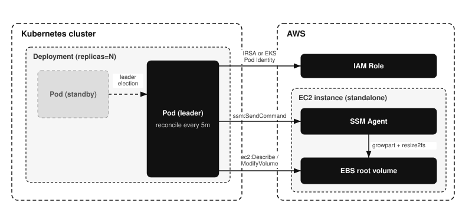

# How it works

How the resize loop finds, measures, and grows a root volume, and what it leaves behind on the cluster. Read this to understand what the addon does to an instance before you enable it.

## Architecture

Operation mechanism. The [Deployment][k8s-deployment] runs one or more [Pods][k8s-pod]; only the leader runs
the reconcile loop and drives EC2 and SSM, while standby Pods take over if the
leader fails. Editable source: [architecture.drawio](assets/architecture.drawio).

## Resize flow

Each reconcile pass processes every matching instance sequentially:

1. **Measure**: run `df` on the instance via [SSM Run Command][ssm-run-command]
   (read-only) and parse the root usage percent.
2. **Decide**: skip if usage is below the effective `usageThresholdPercent`.
3. **Resolve**: find the root EBS volume from the instance block device mapping
   and read its current size.
4. **Guard**: skip if the volume was modified within the cooldown window ([EBS
   allows one modification per volume every 6 hours][ebs-modify-reqs]) or if the
   target size would exceed the effective `maxVolumeSizeGiB`.
5. **Grow**: call [`ec2:ModifyVolume`][ec2-modifyvolume] to the target size. In
   `percent` mode the target is `ceil(current * (1 + GROW_PERCENT/100))`; in
   `absolute` mode it is `current + GROW_AMOUNT` (rounded up to whole GiB).
6. **Wait**: poll until the modification reaches [`optimizing`][ebs-monitor]
   (filesystem extension is safe from that point).
7. **Extend**: run [`growpart` + `resize2fs`][ebs-extend-fs] via [SSM Run
   Command][ssm-run-command].
8. **Verify**: re-measure usage and log before/after.

`DRY_RUN=true` stops after the decision and never mutates anything.

## SSM execution context

The addon uses SSM **Run Command** (`SendCommand` + `AWS-RunShellScript`), which
the SSM Agent executes as **root** by default. This differs from interactive
Session Manager (`start-session`), which runs as the unprivileged `ssm-user`.
So `growpart` and `resize2fs` run with the privileges they need without `sudo`.
The resize script still falls back to `sudo` for hardened AMIs configured to run
commands as a non-root user.

## Kubernetes Events

Each resize attempt emits an [Event][k8s-events] on the controller's own Pod (`ResizeStarted`,
`ResizeCompleted`, `ResizeFailed`), readable via [`kubectl describe pod`][k8s-kubectl-describe] or
`kubectl -n <namespace> get events`. The Pod reference is built from the downward
API, so the controller only needs create/patch on Events, granted by the chart's
Role and RoleBinding.

When the throughput recommender is enabled and the modified volume belongs to a
Kubernetes [Node][k8s-node] the recommender has evaluated, the outcome is additionally
published on that Node (`VolumeModified`, `VolumeModifyFailed`), so it shows up in
`kubectl describe node`. The message enumerates every dimension the modification
changed (size always; throughput and IOPS when a recommendation was piggybacked),
and names a piggybacked change that was attempted but rejected. Standalone EC2
instances have no Node object, so they keep Pod-side Events only.

## High availability

The chart enables [leader election][k8s-leader-election] automatically when `replicaCount` is above 1,
so extra replicas stand by and only the leader reconciles. This avoids concurrent
`ModifyVolume` calls against the same volume. The leader holds a
`coordination.k8s.io` [Lease][k8s-leases] in its own namespace.

[ebs-modify-reqs]: https://docs.aws.amazon.com/ebs/latest/userguide/modify-volume-requirements.html
[ebs-monitor]: https://docs.aws.amazon.com/ebs/latest/userguide/monitoring-volume-modifications.html
[ebs-extend-fs]: https://docs.aws.amazon.com/ebs/latest/userguide/recognize-expanded-volume-linux.html
[ec2-modifyvolume]: https://docs.aws.amazon.com/AWSEC2/latest/APIReference/API_ModifyVolume.html
[ssm-run-command]: https://docs.aws.amazon.com/systems-manager/latest/userguide/run-command.html

[k8s-deployment]: https://kubernetes.io/docs/concepts/workloads/controllers/deployment/
[k8s-pod]: https://kubernetes.io/docs/concepts/workloads/pods/
[k8s-events]: https://kubernetes.io/docs/reference/kubernetes-api/cluster-resources/event-v1/
[k8s-kubectl-describe]: https://kubernetes.io/docs/reference/kubectl/generated/kubectl_describe/
[k8s-node]: https://kubernetes.io/docs/concepts/architecture/nodes/
[k8s-leader-election]: https://kubernetes.io/docs/concepts/architecture/leases/#leader-election
[k8s-leases]: https://kubernetes.io/docs/concepts/architecture/leases/
