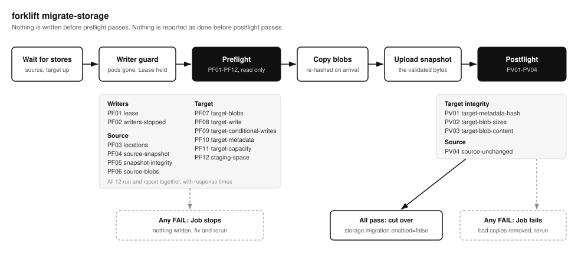

# Storage migration

Moves a forklift deployment from one S3-compatible store to another, for example from MinIO to the bundled SeaweedFS. The chart runs it as a Job. Every safety check passes before the first write, and the copy is verified for integrity before the Job reports success.



## Why MinIO to SeaweedFS

Charts before 0.14.0 bundled MinIO from the public quay.io registry (`quay.io/minio/minio`). Those images were removed, so a fresh install or a rescheduled MinIO pod can no longer pull them. See [IBM's advisory](https://www.ibm.com/support/pages/node/7289585) for the removal. Chart 0.14.0 bundles SeaweedFS instead, and `forklift migrate-storage` copies existing data across.

## What moves

| Data | Key | Copy rule |
|------|-----|-----------|
| Blobs the metadata names | `<prefix>/blobs/aa/bb/<sha256>` | Skipped when already in the target. Each copy is re-hashed and compared to its digest. Unreferenced blobs are not copied |
| Metadata snapshot | `<prefix>/meta/forklift.db` | Uploaded last, from the same staged file that passed the integrity check |

Named blobs are the union of `blobs`, `artifacts`, `group_metadata_cache` and `artifact_upload_staged_blobs` in the snapshot. The snapshot's fencing token is not copied: it is the source cluster's Lease transition count, and the target's first leader writes its own.

`migrate-storage` copies between object stores only. The fs backend and PV replication are out of scope.

## Steps: MinIO to bundled SeaweedFS

1. Upgrade to chart 0.14.0 or later, still on MinIO.
2. Start the migration. The chart keeps forklift at 0 replicas, starts the bundled SeaweedFS and runs the Job. Start with `dryRun=true` to see the preflight report without copying.

   ```bash
   helm upgrade forklift oci://ghcr.io/younsl/charts/forklift --version 0.14.0 \
     --namespace forklift --reuse-values \
     --set seaweedfs.enabled=true \
     --set storage.s3.endpoint= --set storage.s3.provider= --set storage.s3.existingSecret= \
     --set storage.migration.enabled=true \
     --set storage.migration.sourceObjectStorage.endpoint=http://minio:9000 \
     --set storage.migration.sourceObjectStorage.bucket=forklift \
     --set storage.migration.sourceObjectStorage.region=us-east-1 \
     --set storage.migration.sourceObjectStorage.existingSecret=minio-creds \
     --set storage.migration.dryRun=true
   kubectl logs -n forklift job/forklift-migrate-r<revision>
   ```

3. Rerun the same command with `storage.migration.dryRun=false`.
4. Bring forklift back on SeaweedFS with `--set storage.migration.enabled=false`.
5. Verify, then retire MinIO. The source is never written to, so rolling back is reverting the Helm values.

The Job is named `<fullname>-migrate-<hash>`, where the hash covers every `storage.migration` value, the image and the target. Changing any of them (for example `dryRun`) creates a new Job instead of editing an immutable one, and an unchanged sync leaves a finished Job alone. Set `storage.migration.runId` to rerun with the same settings. The Job is kept after the release moves on (`helm.sh/resource-policy: keep`) until `ttlSecondsAfterFinished` removes it. Its pod carries `karpenter.sh/do-not-disrupt: "true"`. Set the key to `null` to drop it.

## Preflight

All checks run and are reported together, so one rerun fixes every problem at once. Any `FAIL` stops the Job before it writes. Checks that talk to a service show their response time.

| ID | Check | Fails when |
|----|-------|------------|
| PF01 | lease | Another instance holds the HA Lease after `wait` |
| PF02 | writers-stopped | A pod matching the forklift selector is still present after `wait`. Holding the Lease is not enough: a leader releases it before its final snapshot flush ends |
| PF03 | locations | Source and target are the same bucket on the same endpoint with nested prefixes |
| PF04 | source-snapshot | The source has no snapshot, or the download is truncated |
| PF05 | snapshot-integrity | `PRAGMA integrity_check` fails, there is no `blobs` table, or a digest is malformed |
| PF06 | source-blobs | A named blob is missing in the source, unless `allowMissingSourceBlobs` |
| PF07 | target-blobs | The target cannot be listed |
| PF08 | target-write | A probe object cannot be written, read back identically and deleted |
| PF09 | target-conditional-writes | The target ignores `If-Match`/`If-None-Match` while `replicaCount > 1` |
| PF10 | target-metadata | The target already holds a snapshot, unless `overwriteMeta` |
| PF11 | target-capacity | The target admin API reports less free space than the bytes to copy |
| PF12 | staging-space | `/tmp` cannot hold the `concurrency` largest blobs plus 64 MiB |

```text
  [PASS] PF01 lease                      forklift/forklift-leader held as forklift-migrate-... (took 3.7 ms)
  [PASS] PF06 source-blobs               all 31 named blobs present, 31 HEAD requests, avg 0.9 ms, max 2.3 ms (took 4.3 ms)
  [FAIL] PF10 target-metadata            a snapshot already exists; pass --overwrite-meta to replace it (took 0.5 ms)
  [PASS] PF11 target-capacity            8.1 MiB to copy, 27.4 GiB available (took 1.8 ms)
preflight: 12 checks, 11 passed, 0 warned, 1 failed, 0 skipped (PF10)
```

A check is `SKIP` when an earlier failure leaves nothing to check, so the total is always 12. Before the checks, the Job waits up to `wait` for both stores to answer, which covers a bundled target starting in the same upgrade. With the bundled SeaweedFS (or `storage.s3.createBucket`) it then creates the target bucket when it is missing, since its chart hook may not have run yet.

## Argo CD

The steps work the same under Argo CD, with three behaviours to know:

- Argo CD runs Helm `post-install` hooks as PostSync, after every resource is healthy, which is why forklift and the migration Job create the bucket themselves. Since chart 0.15.0 the bundled SeaweedFS renders no bucket hook unless `seaweedfs.allInOne.s3.createBuckets` is set, and then the hook finds the bucket and skips it.
- Argo CD renders every sync as revision 1. The hash in the Job name, not the revision, is what gives each new setting a new Job.
- Argo CD renders without `lookup`, so Secrets that Helm keeps by looking them up come out new on every render. The SeaweedFS subchart's own S3 identities Secret generates a random read-only key that way, and its hash is on the SeaweedFS pod, which would restart it on every sync. The chart therefore writes the identities to `forklift-seaweedfs-s3-config` itself, admin only and identical on every render (`seaweedfs.allInOne.s3.existingConfigSecret`). With `seaweedfs.s3.credentials.admin.existingSecret` the file names the keys as `${SEAWEEDFS_S3_ADMIN_ACCESS_KEY_ID}` and `${SEAWEEDFS_S3_ADMIN_SECRET_ACCESS_KEY}`, which SeaweedFS reads from that Secret.

## During the copy

- The Job holds the Lease for the whole run, so a forklift replica that starts meanwhile stays a standby. Losing the Lease aborts before the metadata upload.
- Every named blob is checked in the target after the copy.
- The source snapshot ETag must be unchanged before the metadata upload.

## Postflight

After the metadata upload the Job verifies the target. Any `FAIL` makes the Job fail, and the Job then deletes the target blobs it proved wrong together with the target metadata snapshot. A rerun copies them again. Without that cleanup a corrupt blob would be skipped forever as already present.

| ID | Check | Fails when |
|----|-------|------------|
| PV01 | target-metadata-hash | The target snapshot downloaded again has a different SHA-256 from the staged one, fails `integrity_check`, or names a different set of blobs |
| PV02 | target-blob-sizes | A named blob is missing in the target or its size differs from `blobs.size`. Every blob is checked |
| PV03 | target-blob-content | A re-downloaded blob does not hash to its digest |
| PV04 | source-unchanged | The source snapshot ETag changed after the upload |

PV03 target-blob-content follows `verify`. `sample` (default) re-hashes `verifySamplePercent` of the named blobs, at least 20, taking first the blobs the copy skipped as already present, since every copied blob was already hashed on its way in. `full` re-hashes all of them, and `off` skips PV03.

```text
  [PASS] PV01 target-metadata-hash       sha256 51ec8321aa9a... matches, 336.0 KiB (integrity ok) (took 3.9 ms)
  [PASS] PV02 target-blob-sizes          all 31 named blobs match their recorded size, 31 HEAD requests, avg 0.7 ms, max 1.5 ms (took 3.5 ms)
  [FAIL] PV03 target-blob-content        1 of 20 hashed blobs do not match their digest (first: 55b454e8c4ef...) (took 13 ms)
  [PASS] PV04 source-unchanged           source snapshot ETag unchanged since preflight (took 1.0 ms)
postflight: 4 checks, 3 passed, 0 warned, 1 failed, 0 skipped (PV03)
removed 1 bad target blobs and the target metadata snapshot; rerun to copy them again
```

The Job prints a JSON report on stdout:

```json
{"required":31,"copied":31,"skipped":0,"bytes_copied":8473536,"meta_copied":true,"dry_run":false,"verified_blobs":20,"preflight":[...],"postflight":[{"id":"PV01","name":"target-metadata-hash","status":"pass","detail":"...","latency_us":3900}]}
```

## History

Every run, succeeded, failed or dry, writes a record to the target bucket at `<prefix>/meta/migrations/<id>.json` before the Job exits. The id is the finish time plus a random suffix, so ids sort by time. A run that cannot write to the target leaves no record and its Job log is the only trace.

The Storage page lists the newest 100 records with the source and target providers, the share of blobs copied and every check as a status dot. Opening a run shows the full report: the stage each run reached (preflight, copy, verify, upload, postflight), the failing checks and what postflight removed, timings and settings, every preflight and postflight check with its latency, and the bucket, key and URI the record was read from. A JSON tab shows the stored record as is.

The same data is in the admin API: `GET /api/v1/storage/migrations` lists summaries and `GET /api/v1/storage/migrations/{id}` returns one record with `stored_at`. With the `fs` backend the list is empty.

## Values

| Value | Default | Effect |
|-------|---------|--------|
| `storage.migration.enabled` | `false` | Runs the Job and keeps forklift at 0 replicas |
| `storage.migration.sourceObjectStorage.*` | | `endpoint`, `bucket` (required), `prefix`, `region`, `forcePathStyle`, `existingSecret` (keys `access-key-id`, `secret-access-key`) |
| `storage.migration.dryRun` | `false` | Runs preflight and reports the plan only |
| `storage.migration.overwriteMeta` | `false` | Replaces a snapshot already in the target |
| `storage.migration.allowMissingSourceBlobs` | `false` | Carries over metadata whose blobs are already missing, turning PF06 source-blobs into a warning |
| `storage.migration.concurrency` | `8` | Blobs copied in parallel |
| `storage.migration.wait` | `3m` | Wait for writers to exit, the Lease to free and both stores to answer |
| `storage.migration.verify` | `sample` | PV03 target-blob-content mode: `off`, `sample` or `full` |
| `storage.migration.verifySamplePercent` | `5` | Share of named blobs PV03 target-blob-content re-hashes in sample mode, at least 20 |
| `storage.migration.runId` | | Change to rerun with otherwise identical settings |
| `storage.migration.stagingSizeLimit` | | `emptyDir` limit for `/tmp` |

The target is the chart's own storage configuration, bundled SeaweedFS included. `--require-conditional-writes` is passed when `replicaCount > 1`.

## Running without the chart

`forklift migrate-storage` reads the source from `FORKLIFT_STORAGE_S3_*` and the target from `FORKLIFT_MIGRATE_TO_S3_BUCKET`, `_PREFIX`, `_REGION`, `_ENDPOINT`, `_FORCE_PATH_STYLE`, `_ACCESS_KEY_ID`, `_SECRET_ACCESS_KEY`, plus `_CREATE_BUCKET` to create a missing target bucket and `_PROVIDER`, `_ADMIN_ENDPOINT` and `_ADMIN_TOKEN` for PF11 target-capacity. Run `forklift migrate-storage -h` for the flags. Without `--lease-name` and `--writer-selector`, PF01 lease and PF02 writers-stopped become a warning that the operator must make sure every replica is stopped.

`--interactive` (`-i`) prompts for the target (the secret is not echoed), runs the preflight, prints the report and copies only after `y`:

```bash
kubectl run forklift-migrate --rm -it --restart=Never -n forklift \
  --image ghcr.io/younsl/forklift:0.14.0 \
  --env FORKLIFT_STORAGE_BACKEND=s3 --env FORKLIFT_STORAGE_S3_BUCKET=forklift \
  --env FORKLIFT_STORAGE_S3_ENDPOINT=http://minio:9000 ... \
  -- migrate-storage -i
```

## Other providers

Any pair below works in either direction. Verified on kind with MinIO RELEASE.2025-09-07, SeaweedFS 4.48, Garage v2.4.1 and RustFS 1.0.0.

| Target | Notes |
|--------|-------|
| [SeaweedFS](https://github.com/seaweedfs/seaweedfs) | Bundled default. Set `storage.s3.provider=seaweedfs` and the master as `adminEndpoint` when external |
| [RustFS](https://github.com/rustfs/rustfs) | `provider=rustfs` |
| [Garage](https://git.deuxfleurs.fr/Deuxfleurs/garage) | `provider=garage`, `adminEndpoint` on port 3903, `admin-token` in `existingSecret`. Needs `replicaCount: 1`: PF09 target-conditional-writes fails with HA |
| [AWS S3](https://aws.amazon.com/s3/) | Leave the endpoint empty and use IRSA or static keys |

## Troubleshooting

| Message | Fix |
|---------|-----|
| `PF02 writers-stopped ... forklift pods still running` | Find the pod outside the Deployment (or a manual scale) and remove it |
| `PF01 lease ... still held by another instance` | A forklift replica or another migration holds the Lease |
| `source metadata changed during the copy` | A writer reached the source after preflight. Stop it and rerun. Copied blobs are skipped |
| `lost the HA lease` | The Lease was taken during the copy. Rerun once nothing else contends for it |
| `... is not reachable` | The endpoint, bucket or credentials are wrong, or the store did not come up within `wait` |
| `postflight failed ... removed N bad target blobs` | The target held corrupt or truncated copies. Rerun to copy them again, and check the target store's health if it repeats |
| `PF06 source-blobs N named blobs are missing in the source` | The source already lost those blobs, so their artifacts fail to download today too. Check `forklift_dangling_blob_refs_total` or the Storage page's broken artifacts before the cutover. Delete or reupload them in the source and rerun, or set `allowMissingSourceBlobs` to carry them over in the same broken state and fix them from the Storage page afterwards. PF05 reports the same count as `without a blobs row` |
| No log line for minutes after `acquired leadership` | Preflight prints its report only when every check is done. A large snapshot takes time to download (2.9 GiB took about 4 minutes) and `integrity_check` reads all of it from staging, bound by disk rather than CPU. Watch the Job pod's network and disk reads instead of its log, and budget the same again for PV01 after the copy |
| `object store not ready; retrying ... connection closed before message completed` right after the Job starts | The bundled SeaweedFS is still starting. The Job retries until `wait` runs out, then creates the bucket and continues |
| The SeaweedFS pod restarts on every Argo CD sync | The subchart's S3 identities Secret holds a random read-only key that changes on every render without `lookup`. Keep `seaweedfs.allInOne.s3.existingConfigSecret` set so the chart writes a stable identities file instead |
| `secret "<release>-seaweedfs-s3-secret" not found` when SeaweedFS starts | The manifests were applied without Helm hooks, and the subchart creates that Secret in a `pre-install` hook. Keep `seaweedfs.allInOne.s3.existingConfigSecret` set, or apply the hooks first |

## Conclusion

- A migration is a chart Job: preflight before the first write, a verified copy, then postflight on the target. Every run leaves a record on the Storage page.
- forklift stays at 0 replicas from the first sync with `storage.migration.enabled` until the cutover, dry run included. Run the dry run, the copy and the cutover back to back.
- Read the dry run's preflight before copying. A failure there costs nothing, while the copy itself takes the snapshot download twice plus the blobs.
- Blobs already missing in the source are a source problem. Decide before the copy whether to fix them first or carry them over broken.
