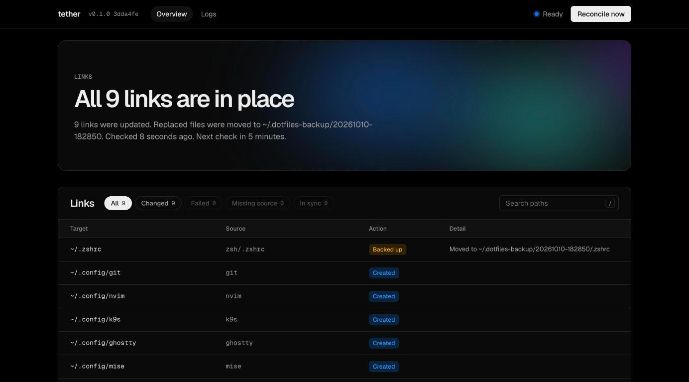
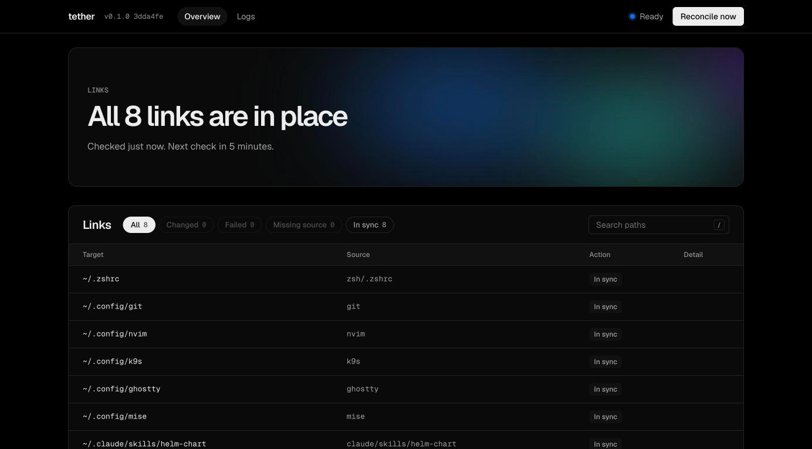
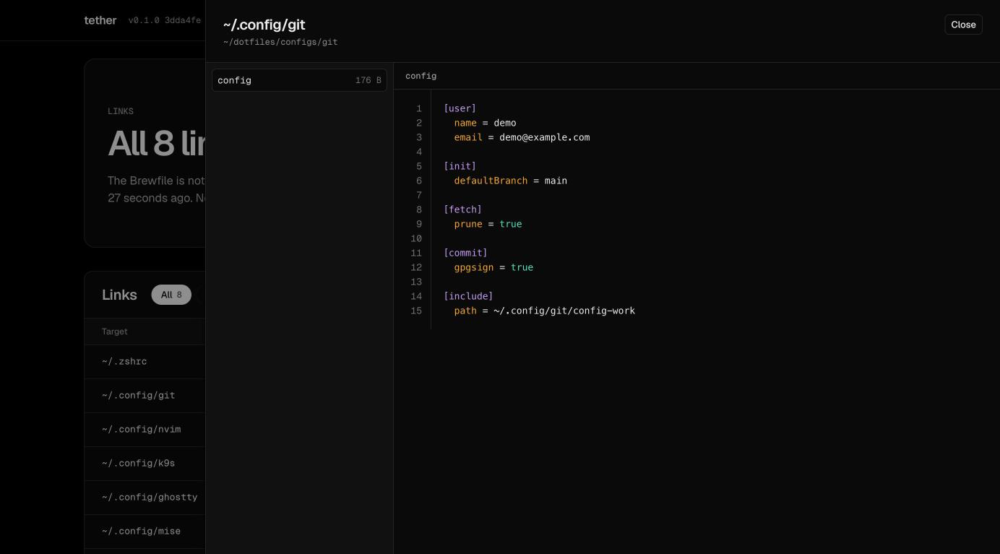
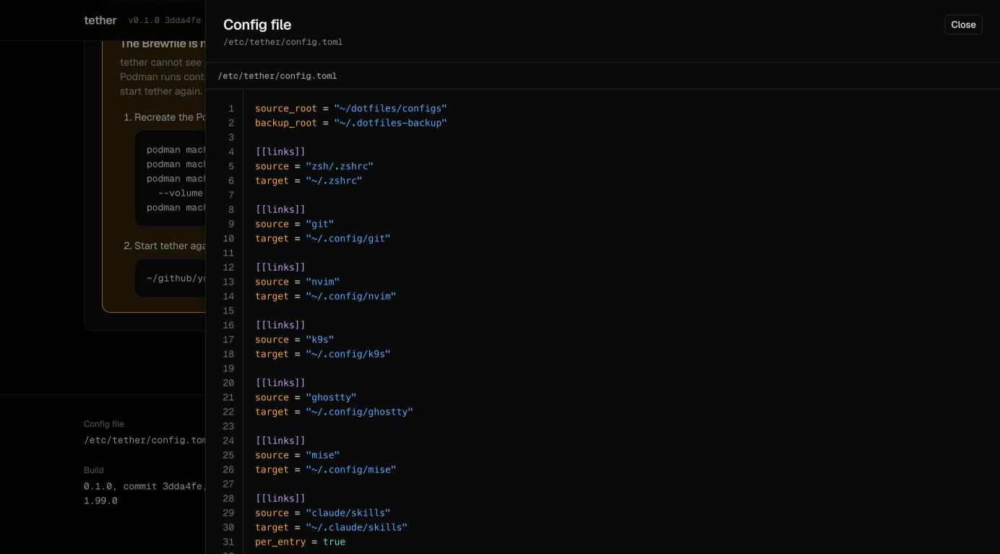
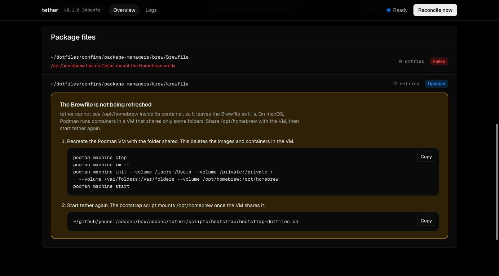
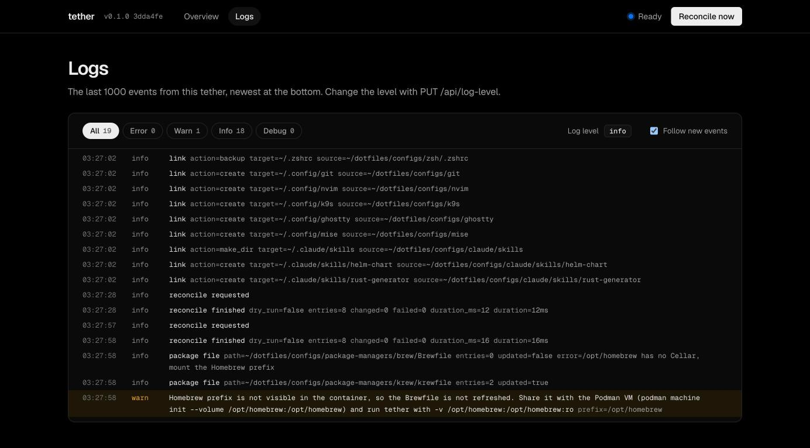

# tether

[](https://github.com/younsl/addons/pkgs/container/tether)
[](https://www.rust-lang.org/)
[](https://github.com/younsl/addons/blob/main/LICENSE)

A small server that keeps personal macOS dotfiles symlinked into a home directory, plus the dotfiles themselves. Shipped as a statically linked Rust 1.99.0 binary on a scratch image for linux/amd64 and linux/arm64. The image holds only the binary, never the dotfiles.

## Features

- **Self-healing symlinks**: every 5 minutes, or on demand, each config is linked back into place. A real file in the way is moved to a timestamped backup directory, never deleted.
- **Per-entry links**: a directory such as ~/.claude/skills gets one link per entry, so files other tools add there stay put.
- **Package files from disk**: the Brewfile and krewfile are regenerated from what is installed, matching brew bundle dump line for line, and rewritten only when the package list changes.
- **Web console**: the last reconcile, every link with its action, package files, and a reconcile button at http://127.0.0.1:8080.
- **Read-only file viewer**: click a link or the config file to read it with syntax highlighting. Only files tracked in git appear, so local-only files such as work settings and keys stay hidden.
- **Logs page**: tether's last 1000 log events at /logs, filtered by level, followed live, with the current log level and a copy button on each line.
- **Safe by default**: the console answers only on localhost, handlers never read the file system, and the scratch image holds only the binary.
- **Observable**: Prometheus metrics, health and readiness probes, and a log level you can change at runtime.

## Quick start

```bash
git clone https://github.com/younsl/addons ~/github/younsl/addons
~/github/younsl/addons/box/addons/tether/scripts/bootstrap/bootstrap-dotfiles.sh
curl -s 127.0.0.1:8080/api/status
```

## Screenshots

Captured from a demo home, one scenario each.

<details>
<summary>First run: links created, a real file backed up</summary>



</details>

<details>
<summary>Steady state: every link in place</summary>



</details>

<details>
<summary>Reading a linked config</summary>



</details>

<details>
<summary>Reading tether's own config file</summary>



</details>

<details>
<summary>Brewfile not refreshed: Podman setup guide</summary>



</details>

<details>
<summary>Logs page</summary>



</details>

## Docs

- [Architecture](docs/architecture.md): reconcile loop, actions, image contents
- [Usage](docs/usage.md): run, console, API
- [Configuration](docs/configuration.md): settings, config.toml, mounts, load errors
- [Dotfiles](docs/dotfiles.md): layout, fresh machine, local-only files

## Development

```bash
make run        # dry-run reconcile of config.toml against the local home
make lint test coverage
make docker-build
```

## License

This repository is licensed under the Apache License 2.0. See the [LICENSE](../../../LICENSE) file for details.
