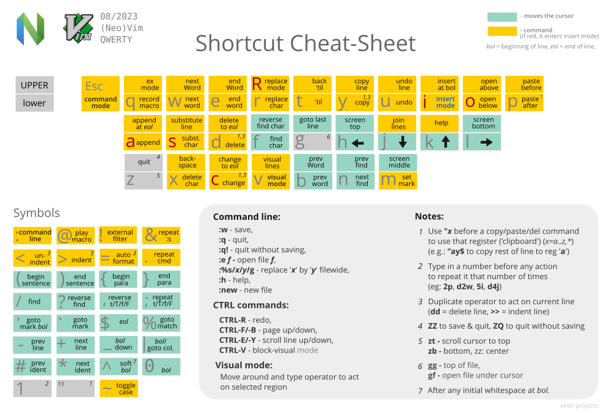

# Neovim Key Mappings

This document provides a comprehensive overview of custom key mappings for Neovim configuration. The leader key is set to Space (`␣`).

## Cheatsheet



```bash
:%d    # [Command Mode] 전체 내용 삭제
ggVGd  # [Normal Mode] 전체 선택 후 삭제
```

## Core Mappings

> Mode: `n` (Normal Mode), `i` (Insert Mode)

### Tab Management
| Key | Mode | Action | Description |
|-----|------|--------|-------------|
| `␣t` | `n` | `:tabnew` | Open new tab |
| `␣]` | `n` | `:tabnext` | Next tab |
| `␣[` | `n` | `:tabprevious` | Previous tab |
| `␣x` | `n` | `:tabclose` | Close current tab |

### Window Operations
| Key | Mode | Action | Description |
|-----|------|--------|-------------|
| `␣v` | `n` | `:vsplit` | Vertical split |
| `␣h` | `n` | `:split` | Horizontal split |
| `␣q` | `n` | `:close` | Close window |
| `Ctrl-h` | `n` | `<C-w>h` | Move to left window |
| `Ctrl-j` | `n` | `<C-w>j` | Move to bottom window |
| `Ctrl-k` | `n` | `<C-w>k` | Move to top window |
| `Ctrl-l` | `n` | `<C-w>l` | Move to right window |

### File Operations
| Key | Mode | Action | Description |
|-----|------|--------|-------------|
| `␣w` | `n` | `:w` | Save file |
| `␣nh` | `n` | `:nohlsearch` | Clear search highlights |

## Plugin Mappings

### Nvim-Tree
| Key | Mode | Action | Description |
|-----|------|--------|-------------|
| `␣n` | `n` | `:NvimTreeToggle` | Toggle file explorer |
| `␣c` | `n` | `:NvimTreeCollapse` | Collapse all folders |
| `␣g` | `n` | Custom function | Focus ~/github/ directory |

### Picker (native)

Cmdline autocompletion shows a fuzzy popup as you type. `Tab` moves through items, `Enter` opens the selected item (or the first one when nothing is selected).

| Key | Mode | Action | Description |
|-----|------|--------|-------------|
| `␣ff` | `n` | `:find` | Fuzzy search files (`fd`, falls back to `globpath()`) |
| `␣fg` | `n` | `:Grep` | Live grep from the second character (`git grep` in a repo, `grep -r` otherwise), then jump to the match |
| `␣fb` | `n` | `:buffer` | Fuzzy search open buffers |
| `␣fh` | `n` | `:help` | Fuzzy search help tags |

### Completion (native)
| Key | Mode | Action | Description |
|-----|------|--------|-------------|
| `Tab` | `i` | `<C-n>` / `vim.snippet.jump(1)` | Next completion item, or jump to next snippet placeholder |
| `Shift-Tab` | `i` | `<C-p>` / `vim.snippet.jump(-1)` | Previous completion item, or jump to previous snippet placeholder |
| `Enter` | `i` | `<C-y>` / `autopairs_cr()` | Confirm selected (or first) item, otherwise newline with autopairs indent |
| `Ctrl-Space` | `i` | `vim.lsp.completion.get()` | Trigger completion manually (`<C-n>` when no LSP client is attached) |
| `Ctrl-s` | `i` | `vim.lsp.buf.signature_help()` | Show signature help (Neovim default) |
| `Ctrl-x Ctrl-f` | `i` | File name completion | Complete file paths (Neovim default) |

### Git Fugitive (vim-fugitive)
| Key | Mode | Action | Description |
|-----|------|--------|-------------|
| `␣gs` | `n` | `:Git` | Git status |
| `␣gd` | `n` | `:Git diff` | Git diff all changes |
| `␣gdf` | `n` | `:Gdiff` | Git diff current file |
| `␣ga` | `n` | `:Git add .` | Git add all files |
| `␣gc` | `n` | `:Git commit` | Git commit |
| `␣gcb` | `n` | `:Git checkout -b` | Git create new branch |
| `␣gac` | `n` | Custom function | Git add all and commit |
| `␣gp` | `n` | `:Git push` | Git push |
| `␣gl` | `n` | `:Git log` | Git log |
| `␣gb` | `n` | `:Git blame` | Git blame |
| `␣gq` | `n` | `:Git close` | Close all git windows |

### Gitsigns

**Hunk**: A continuous block of changed lines in a file. Git groups related line changes together as a single "hunk" - this could be added lines (+), deleted lines (-), or modified lines (~). Each hunk represents a logical unit of change that can be staged or reset independently.

| Key | Mode | Action | Description |
|-----|------|--------|-------------|
| `]h` | `n` | `next_hunk` | Jump to next git hunk (next block of changes) |
| `[h` | `n` | `prev_hunk` | Jump to previous git hunk (previous block of changes) |
| `␣hs` | `n` | `stage_hunk` | Stage current hunk (add to git index) |
| `␣hr` | `n` | `reset_hunk` | Reset current hunk (discard changes) |
| `␣hs` | `v` | `stage_hunk` | Stage selected hunk (add to git index) |
| `␣hr` | `v` | `reset_hunk` | Reset selected hunk (discard changes) |
| `␣hS` | `n` | `stage_buffer` | Stage entire buffer (add all file changes) |
| `␣hu` | `n` | `undo_stage_hunk` | Undo stage hunk (remove from git index) |
| `␣hR` | `n` | `reset_buffer` | Reset entire buffer (discard all changes) |
| `␣hp` | `n` | `preview_hunk` | Preview hunk changes (show diff popup) |
| `␣hb` | `n` | `blame_line` | Show git blame for line (who changed it) |
| `␣hd` | `n` | `diffthis` | Diff current file (compare with HEAD) |
| `␣hD` | `n` | `diffthis('~')` | Diff against index (compare with staged) |
| `␣tb` | `n` | `toggle_current_line_blame` | Toggle line blame display |
| `␣td` | `n` | `toggle_deleted` | Toggle deleted lines visibility |
| `ih` | `o`,`x` | `select_hunk` | Select hunk text object (for operations) |

### Treesitter Selection (native)
| Key | Mode | Action | Description |
|-----|------|--------|-------------|
| `an` | `v` | Expand selection | Expand selection to the parent treesitter node |
| `in` | `v` | Shrink selection | Shrink selection to the child treesitter node |
| `]n` / `[n` | `v` | Next/previous node | Move selection to the next or previous node |
| `]N` / `[N` | `v` | Extend to sibling | Extend selection to the next or previous sibling node |

### Treesitter Context (nvim-treesitter-context)
| Key | Mode | Action | Description |
|-----|------|--------|-------------|
| `[c` | `n` | Jump to context | Jump to the context line |

### vim-sandwich

**Add surroundings:** mapped to the key sequence `sa` (add)
```
{surrounded text} → {surrounding}{surrounded text}{surrounding}
```

**Delete surroundings:** mapped to the key sequence `sd` (delete)
```
{surrounding}{surrounded text}{surrounding} → {surrounded text}
```

**Replace surroundings:** mapped to the key sequence `sr` (replace)
```
{surrounding}{surrounded text}{surrounding} → {new surrounding}{surrounded text}{new surrounding}
```

| Key | Mode | Action | Description |
|-----|------|--------|-------------|
| `sa{motion/textobject}{addition}` | `n` | Surround **a**dd | Add surroundings (e.g., `saiw"` adds quotes around word) |
| `sd{deletion}` | `n` | Surround **d**elete | Delete surroundings (e.g., `sd"` deletes quotes) |
| `sr{deletion}{addition}` | `n` | Surround **r**eplace | Replace surroundings (e.g., `sr"'` replaces " with ') |
| `ib`/`ab` | `o`,`v` | Text object | Select text inside/around brackets |
| `is`/`as` | `o`,`v` | Text object | Select text inside/around sandwich |
| `.` | `n` | Repeat operation | Repeat last vim-sandwich operation (built-in support) |

**Common Examples:**

| Freq | Command | Example | Description |
|------|---------|---------|-------------|
| ✓ | `saiw"` | `Hello world!` → `"Hello" world!` | Add double quotes around word (`iw` = inner word) |
| ✓ | `saiW"` | `Hello-world!` → `"Hello-world!"` | Add double quotes around WORD (`iW` = inner WORD, includes punctuation) |
|   | `sr"'` | `"Hello world!"` → `'Hello world!'` | Replace double quotes with single quotes |
|   | `sr'<q>` | `'Hello world!'` → `<q>Hello world!</q>` | Replace single quotes with `<q>` tag |
|   | `srt"` | `<q>Hello world!</q>` → `"Hello world!"` | Replace HTML tag with double quotes |
|   | `sd"` | `"Hello world!"` → `Hello world!` | Delete double quotes |
|   | `V` + `S<p>` | `Hello world!` → `<p>Hello world!</p>` | Add `<p>` tag around selected lines |

## Plugin Setup

Plugins are managed by [vim.pack](https://neovim.io/doc/user/pack.html), the plugin manager built into Neovim 0.12. Every plugin is declared once in [`lua/config/pack.lua`](./lua/config/pack.lua), and each `lua/plugins/<name>.lua` file only holds that plugin's setup code.

- Revisions are pinned in [`nvim-pack-lock.json`](./nvim-pack-lock.json), which is tracked in git. A fresh machine installs exactly these revisions on first start.
- Plugins auto-update once a day on startup, like lazy.nvim's checker. The last run time is tracked in `~/.local/state/nvim/pack-last-update`, and every update is logged in `~/.local/state/nvim/log/nvim-pack.log`. Restart Neovim to load the updated code.
- Auto-update rewrites `nvim-pack-lock.json`, so commit it after an update to keep other machines on the same revisions.
- The UI blocks while the update fetches, since `vim.pack.update()` waits for every `git fetch` to finish.
- To review before applying, run `:lua vim.pack.update()`, read the changes in the confirmation tab, then `:write` to apply or `:quit` to discard.
- `nvim-treesitter` runs `:TSUpdate` from a `PackChanged` hook after each update.
- To remove a plugin, delete it from `pack.lua`, then run `:lua vim.pack.del({ "<name>" })`.

Plugins:

- [conform.nvim](https://github.com/stevearc/conform.nvim): Format on save for formatters that are not LSP servers (jq, shfmt, stylua, yamlfmt)
- [gitsigns.nvim](https://github.com/lewis6991/gitsigns.nvim): Git diff indicators in sign column
- [nvim-autopairs](https://github.com/windwp/nvim-autopairs): Auto brackets
- [nvim-tree](https://github.com/nvim-tree/nvim-tree.lua): File explorer
- [nvim-treesitter](https://github.com/nvim-treesitter/nvim-treesitter): Parser installer for languages Neovim does not bundle (uses `main` branch new API after [legacy `nvim-treesitter.configs` module was removed on 2025-05-24](https://github.com/nvim-treesitter/nvim-treesitter/commit/42fc28ba918343ebfd5565147a42a26580579482))
- [nvim-treesitter-context](https://github.com/nvim-treesitter/nvim-treesitter-context): Code context display for better readability
- [vim-fugitive](https://github.com/tpope/vim-fugitive): Git integration
- [vim-sandwich](https://github.com/machakann/vim-sandwich): Set of operators and textobjects to search/select/edit sandwiched texts.

## Native Features

Features that Neovim 0.12 provides natively are used instead of plugins.

- **Plugin manager**: `vim.pack` replaces lazy.nvim.
- **Completion**: `vim.lsp.completion` with `autotrigger` replaces nvim-cmp and its sources. In buffers with an LSP client, every keyword character triggers LSP completion. In other buffers, the `autocomplete` option shows words from the current buffer, other windows, and listed buffers (see [`lua/core/completion.lua`](./lua/core/completion.lua)).
- **Snippets**: `vim.snippet` expands LSP snippets, replacing LuaSnip.
- **Signature help**: `Ctrl-s` in insert mode replaces cmp-nvim-lsp-signature-help.
- **Undo tree**: `:Undotree` from the bundled `nvim.undotree` package.
- **Incremental selection**: treesitter node selection with `an`/`in` in visual mode.
- **Statusline**: hidden with `laststatus=0`, along with `ruler`, `showmode`, and `showcmd`, so the command line area stays empty. Replaces lualine.
- **Indent guides**: `listchars` with `leadmultispace` and `tab`, sized to each buffer's `shiftwidth`, replaces indent-blankline (see [`lua/core/options.lua`](./lua/core/options.lua)).
- **Picker**: `:find` with `findfunc` and `matchfuzzy()`, a `:Grep` command, and cmdline autocompletion via `wildtrigger()` replace telescope (see [`lua/core/picker.lua`](./lua/core/picker.lua)). Based on `:h fuzzy-file-picker` and `:h live-grep`.

Trade-offs accepted:

- File path completion is manual (`Ctrl-x Ctrl-f`) instead of automatic.
- LSP buffers no longer mix buffer words into the completion menu.
- No lazy loading. Startup cost stays low because the plugin count is small.
- No statusline, so git branch, diff counts, diagnostics summary, and LSP progress are not shown.
- Indent guides do not appear on blank lines, and the current scope is not highlighted.
- The picker has no preview window. `:Grep` runs synchronously on each keystroke and caps results at 200 lines.
- data-explorer.nvim was dropped because it is built on telescope.

## Configuration Philosophy

This Neovim configuration follows a **minimalist approach**, prioritizing:
- **Plugin discipline**: Prefer native Neovim features over plugins, and maintain under 15 plugins total, ensuring each serves a clear, essential purpose (see [plugins directory](./lua/plugins/))
- **Functionality over aesthetics**: Focus on essential features that enhance productivity
- **Performance**: Lightweight setup with minimal plugins for fast startup times
- **Simplicity**: Clean configuration that's easy to understand and maintain
- **Vim fundamentals**: Emphasis on core Neovim capabilities rather than complex UI enhancements

## Editor Settings

Notable editor settings include:
- Line numbers enabled (relative)
- Tab width: 2 spaces
- Mouse support enabled
- Column markers at 80 chars (100 for Go files)
- Clipboard integration
- Auto-save on focus lost
- Case-insensitive search
- Statusline, ruler, mode, and pending command display hidden (`laststatus=0`, `noruler`, `noshowmode`, `noshowcmd`)
- Indent guides through `listchars`

For detailed plugin configurations and customization options, refer to the individual plugin files in the `lua/plugins` directory.
