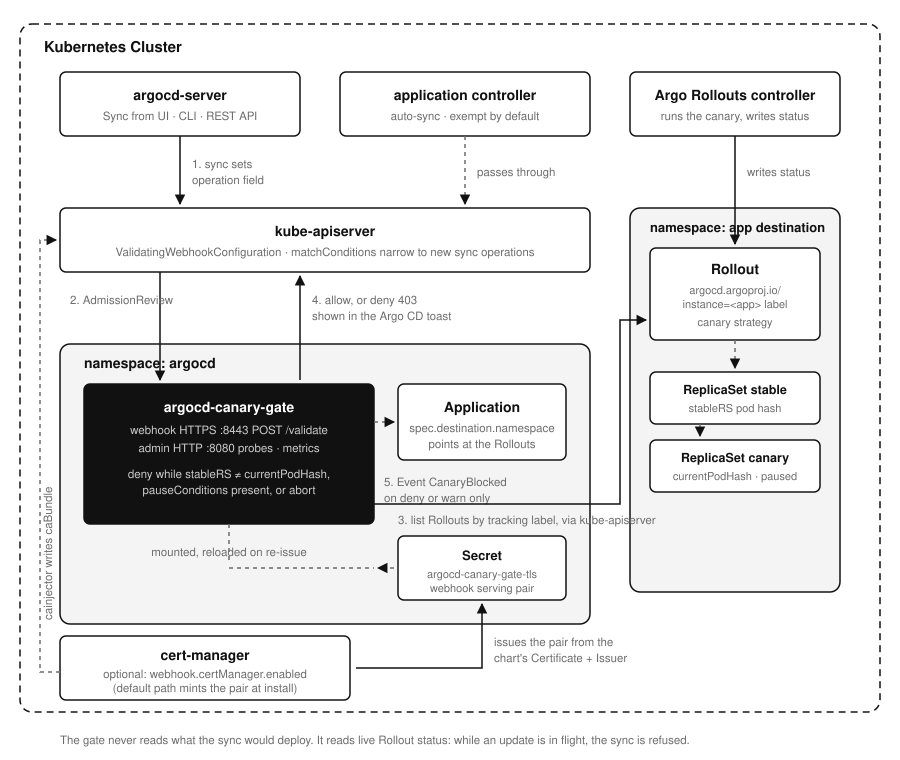

# argocd-canary-gate

[](https://github.com/younsl/o/pkgs/container/argocd-canary-gate)
[](https://github.com/younsl/o/pkgs/container/charts%2Fargocd-canary-gate)
[](https://www.rust-lang.org/)
[](https://argoproj.github.io/rollouts/)
[](https://github.com/younsl/o/blob/main/LICENSE)

Blocks an [Argo CD Application](https://argo-cd.readthedocs.io/en/stable/operator-manual/declarative-setup/#applications) sync while an [Argo Rollouts](https://argoproj.github.io/rollouts/) canary owned by that Application is still in progress. A sync that lands mid-canary hands the Rollout new desired state, which restarts the step progression and throws away the analysis the canary was running. The gate refuses that sync until the rollout is promoted, finished, or aborted. An Application that manages no Rollout syncs freely.



## Why a webhook

A sync is a write that sets the Application's `operation` field, and [admission](https://kubernetes.io/docs/reference/access-authn-authz/extensible-admission-controllers/) is the one place every path takes: the UI Sync button, [`argocd app sync`](https://argo-cd.readthedocs.io/en/stable/user-guide/commands/argocd_app_sync/), and the [REST API](https://argo-cd.readthedocs.io/en/stable/developer-guide/api-docs/) all pass through it. Argo CD renders the denial verbatim in its error toast.

That toast reaches one person once. Every blocked or warned verdict is therefore also recorded as a [Kubernetes Event](https://kubernetes.io/docs/reference/kubernetes-api/cluster-resources/event-v1/) on the Application, so `kubectl describe application prd-payment-api` still answers why it did not deploy. That Event is the only thing the gate writes to the cluster.

## What it checks

On each new sync operation, the gate lists the Rollouts carrying the Application's tracking label (`argocd.argoproj.io/instance=<app>`) in the Application's destination namespace. A Rollout counts as mid-update when any of these hold:

| Signal | Meaning |
| --- | --- |
| `status.stableRS != status.currentPodHash` | Traffic is split between two revisions |
| `status.pauseConditions` non-empty | The canary is waiting at a pause step or for manual promotion |
| `status.abort: true` | The update is rolling back to stable and has not arrived |

A first deploy carries no stable hash and passes, matching Argo Rollouts' own behavior of skipping steps on the initial revision. Only Rollouts using a watched strategy are judged: `canary` by default, `blueGreen` opt-in via `canaryGate.rollouts.strategies`.

Exemptions mirror how Argo CD itself operates. The application controller and automated (auto-sync) operations are exempt by default, since denying a reconcile loop only produces retries, and one Application can opt out with the `canary-gate.younsl.github.io/skip: "true"` annotation. `canaryGate.mode: warn` reports instead of denying, for observing the blast radius before enforcing. Watch `argocd_canary_gate_decisions_total{code="CanaryInProgress"}`, then switch.

## Install

```bash
helm install argocd-canary-gate \
  oci://ghcr.io/younsl/charts/argocd-canary-gate \
  --namespace argocd \
  --values values.yaml
```

The chart generates its own serving certificate, so [cert-manager](https://cert-manager.io/docs/) is not required. No Argo CD API token is needed either: everything the verdict depends on is read from the Kubernetes API, which is why the RBAC is a cluster-wide read on `rollouts` plus `create` on `events` in the Argo CD namespace.

## Failure modes

The webhook registers with `failurePolicy: Fail`, so a gate outage blocks gated syncs rather than silently waving them through. Run more than one replica. When the Rollout list fails while the gate is up, `canaryGate.onError` decides the verdict, `deny` by default for the same reason. A malformed AdmissionReview fails open: the gate cannot judge what it cannot read.

## Development

```bash
make test        # unit tests
make coverage    # cargo llvm-cov, 70% line minimum
make lint        # rustfmt check + clippy -D warnings
make run         # run against the current kubeconfig context
make zigbuild    # static linux/amd64 + linux/arm64 binaries via cargo-zigbuild
```

The container is `scratch` with a statically linked musl binary, built by the shared release workflow in `.github/workflows/_release-rust-scratch-containers.yml` when the `org.opencontainers.image.version` label in the Dockerfile changes.

### Local test environment

`scripts/e2e/up.sh` stands up a kind cluster with real Argo CD, real Argo Rollouts, and the gate built from the working tree, then prints a numbered walkthrough: an allowed sync against a settled Rollout, a denied sync mid-canary, the skip annotation bypass, promote-then-sync, and warn mode. `scripts/e2e/sync.sh <app>` triggers a sync the same way the UI does, so a denial lands as the kubectl error. Needs kind, helm, cargo-zigbuild, and a docker or podman engine. The real kubeconfig is never touched, and `scripts/e2e/down.sh` removes everything.
