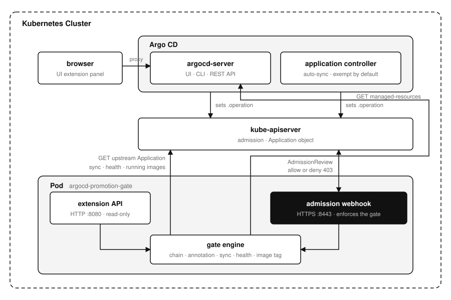

# argocd-promotion-gate

[](https://github.com/younsl/o/pkgs/container/argocd-promotion-gate)
[](https://github.com/younsl/o/pkgs/container/charts%2Fargocd-promotion-gate)
[](https://go.dev/)
[](https://argo-cd.readthedocs.io/en/stable/)
[](https://github.com/younsl/o/blob/main/LICENSE)

Blocks an [Argo CD Application](https://argo-cd.readthedocs.io/en/stable/operator-manual/declarative-setup/#applications) sync until the same application has been promoted in the upstream environment. A production sync is refused while staging is still `OutOfSync`, unhealthy, or running a different image tag. An application with no upstream counterpart is not promotable, so it syncs freely.



## Why a webhook

A sync is a write that sets the Application's `operation` field, and [admission](https://kubernetes.io/docs/reference/access-authn-authz/extensible-admission-controllers/) is the one place every path takes. Disabling a button in the browser would leave [`argocd app sync`](https://argo-cd.readthedocs.io/en/stable/user-guide/commands/argocd_app_sync/), the [REST API](https://argo-cd.readthedocs.io/en/stable/developer-guide/api-docs/), and [auto-sync](https://argo-cd.readthedocs.io/en/stable/user-guide/auto_sync/) untouched. Argo CD renders the denial verbatim in its error toast, and the bundled panel shows the same verdict beforehand by asking the gate rather than re-implementing it.

That toast reaches one person once. Every blocked or warned verdict is therefore also recorded as a [Kubernetes Event](https://kubernetes.io/docs/reference/kubernetes-api/cluster-resources/event-v1/) on the Application, so `kubectl describe application prd-payment-api` still answers why it did not deploy. That Event is the only thing the gate writes to the cluster.

## What it checks

For an Application in a gated environment, in this order. Cheap checks run first, so a denial never spends an Argo CD API call it did not need.

| Check | Denied when | Configurable |
| --- | --- | --- |
| Chain membership | never (an ungated env is passed through) | `promotionGate.chain`, `promotionGate.gatedEnvs` |
| Rollback | never (a revision already deployed here is passed through) | `promotionGate.rollback.allowPreviouslyDeployedRevision` |
| Skip annotation | never (an annotated app is passed through) | `promotionGate.exempt.annotation` |
| Upstream exists | never (an app with no upstream counterpart is passed through) | not configurable |
| Upstream sync | upstream is not `Synced` | `promotionGate.require.sync` |
| Upstream health | upstream is not `Healthy` | `promotionGate.require.health` |
| Image tag | this sync would deploy a tag the upstream is not running | `promotionGate.imageTag.*` |

An Application's environment is its [`spec.project`](https://argo-cd.readthedocs.io/en/stable/user-guide/projects/) and its name is `<project>-<app>`, so `prod-payment-api` has identity `payment-api` and waits on `stage-payment-api`. Nothing else is inferred: the promotion order is configuration.

The [application controller](https://argo-cd.readthedocs.io/en/stable/operator-manual/architecture/#application-controller) is exempt by default, through `promotionGate.exempt.usernames` and `promotionGate.exempt.automated`. Denying it would turn one reconcile into an endless retry loop rather than prevent a promotion.

## Image tag comparison

Running images come from `status.summary.images`, but the images a pending sync would deploy live in git, so the gate reads Argo CD's cached comparison from `GET /api/v1/applications/{name}/managed-resources`. Repositories are matched by basename and only those present on both sides are compared. `promotionGate.imageTag.mode` defaults to `warn`, since `enforce` blocks every application not already on the upstream tag. Watch `argocd_promotion_gate_decisions_total{code="ImageTagMismatch"}`, then switch.

## Install

```bash
helm install argocd-promotion-gate \
  oci://ghcr.io/younsl/charts/argocd-promotion-gate \
  --namespace argocd \
  --values values.yaml
```

The chart generates its own serving certificate, so [cert-manager](https://cert-manager.io/docs/) is not required. The [Argo CD API token](https://argo-cd.readthedocs.io/en/stable/operator-manual/user-management/#local-usersaccounts) and the [argocd-server](https://argo-cd.readthedocs.io/en/stable/operator-manual/architecture/#api-server) extension wiring are the two manual steps. `GET /api/v1/gate?app=prod-payment-api` on port 8080 returns a verdict without syncing.

## Docs

- [docs/configuration.md](docs/configuration.md) for every setting, the Argo CD token, failure modes, rollout order
- [docs/metrics.md](docs/metrics.md) for the metric set, label values, and queries
- [docs/ui-extension.md](docs/ui-extension.md) for wiring the panel into argocd-server
- [docs/development.md](docs/development.md) for build, test, live-cluster runs
