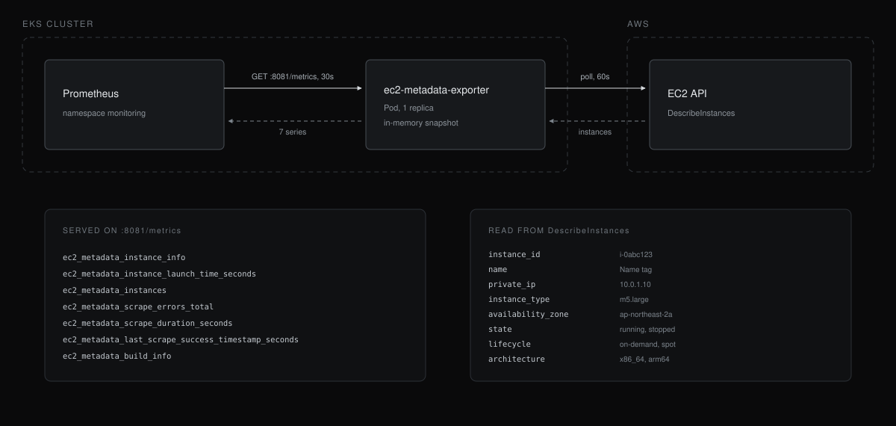

# ec2-metadata-exporter

[](https://github.com/younsl/addons/pkgs/container/ec2-metadata-exporter)
[](https://github.com/younsl/addons/pkgs/container/charts%2Fec2-metadata-exporter)
[](https://www.rust-lang.org/)
[](https://github.com/younsl/addons/blob/main/LICENSE)

Prometheus exporter that polls the EC2 DescribeInstances API and publishes every instance's identity, placement, and IMDS configuration as metric labels. Built with Rust 1.98 and shipped as a statically linked musl binary (cargo-zigbuild) on a scratch image.

## Architecture



The exporter polls EC2 on its own schedule and serves the last successful
snapshot, so a Prometheus scrape never waits on the AWS API.

## Metrics

The exporter serves metrics on `/metrics` (default port `8081`). All metric
names share the prefix `ec2_metadata_`. See [docs/metrics.md](docs/metrics.md)
for the full metric reference, example queries, and alerting hints.

## Configuration

All settings come from environment variables. Each one also has a matching CLI flag (`--scrape-interval`, `--metrics-port`, ...); run with `--help` for the full list.

| Variable | Default | Description |
|----------|---------|-------------|
| `AWS_REGION` | SDK default chain | Region to scan. |
| `SCRAPE_INTERVAL` | `60s` | EC2 API polling interval (humantime duration such as `30s`, `1m30s`, `5m`, min `1s`). |
| `METRICS_PORT` | `8081` | Port serving `/metrics`. |
| `HEALTH_PORT` | `8080` | Port serving `/healthz` and `/readyz`. |
| `LOG_LEVEL` | `info` | `trace`, `debug`, `info`, `warn`, `error`. `RUST_LOG` overrides it with a full tracing filter. |
| `LOG_FORMAT` | `json` | `json` or `text`. |

## Required IAM permissions

```json
{
  "Version": "2012-10-17",
  "Statement": [
    {
      "Effect": "Allow",
      "Action": "ec2:DescribeInstances",
      "Resource": "*"
    }
  ]
}
```

AWS credentials resolve through the SDK default chain (environment variables,
shared config, IRSA, or instance profile).

## Usage

```bash
# Local run
AWS_REGION=ap-northeast-2 LOG_FORMAT=text make run

# Container
docker run --rm -p 8081:8081 \
  -e AWS_REGION=ap-northeast-2 \
  -e AWS_ACCESS_KEY_ID -e AWS_SECRET_ACCESS_KEY -e AWS_SESSION_TOKEN \
  ghcr.io/younsl/ec2-metadata-exporter:latest

curl -s localhost:8081/metrics | grep ec2_metadata_instance_info
```

## Helm

```bash
helm install ec2-metadata-exporter ./charts/ec2-metadata-exporter \
  --namespace monitoring \
  --create-namespace \
  --set config.region=ap-northeast-2 \
  --set serviceMonitor.enabled=true \
  --set serviceAccount.annotations."eks\.amazonaws\.com/role-arn"=arn:aws:iam::123456789012:role/ec2-metadata-exporter
```

The chart is also released to the OCI registry on Chart.yaml version bumps:

```bash
crane ls ghcr.io/younsl/charts/ec2-metadata-exporter
helm install ec2-metadata-exporter oci://ghcr.io/younsl/charts/ec2-metadata-exporter --version 0.1.0
```

See [charts/ec2-metadata-exporter/README.md](charts/ec2-metadata-exporter/README.md) for all values.

## Development

```bash
make build      # Compile debug binary
make test       # Run tests
make coverage   # Enforce 70% minimum line coverage (cargo-llvm-cov)
make lint       # rustfmt check + clippy (-D warnings)
make zigbuild   # Cross-compile static linux/amd64 and linux/arm64 binaries
make all        # fmt + lint + test + build
```

The container image is built from the pre-compiled `ec2-metadata-exporter-linux-<arch>` binaries, so `make docker-build` runs `zigbuild` first. Requires `cargo-zigbuild` and `zig`.
