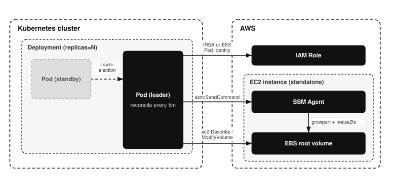

# external-ebs-autoresizer

[](https://github.com/younsl/o/pkgs/container/external-ebs-autoresizer)
[](https://github.com/younsl/o/pkgs/container/charts%2Fexternal-ebs-autoresizer)
[](https://go.dev/)
[](https://github.com/younsl/o/blob/main/LICENSE)

Automatically grows the [root filesystem][ebs-extend-fs] (ext2/3/4 or XFS) of
**standalone EC2 instances** (EC2 outside the Kubernetes cluster, not EKS nodes)
when disk usage crosses a threshold.

It runs as a long-lived Deployment inside EKS and scans instances on an interval.
By default it considers every running instance in its account and region,
excluding EKS cluster nodes (managed node groups, self-managed nodes, and
Karpenter nodes) so it only ever touches standalone EC2. Set `tagFilters` to
narrow the candidate set further. For each instance over the threshold it [grows
the root EBS volume][ebs-modify] and [extends the filesystem][ebs-extend-fs] in
place. Every step is driven and logged by the addon itself rather than delegated
to an opaque SSM runbook, so each action has clear ownership and granular logs.

[ebs-modify]: https://docs.aws.amazon.com/ebs/latest/userguide/requesting-ebs-volume-modifications.html
[ebs-modify-reqs]: https://docs.aws.amazon.com/ebs/latest/userguide/modify-volume-requirements.html
[ebs-monitor]: https://docs.aws.amazon.com/ebs/latest/userguide/monitoring-volume-modifications.html
[ebs-extend-fs]: https://docs.aws.amazon.com/ebs/latest/userguide/recognize-expanded-volume-linux.html
[ec2-modifyvolume]: https://docs.aws.amazon.com/AWSEC2/latest/APIReference/API_ModifyVolume.html
[ssm-run-command]: https://docs.aws.amazon.com/systems-manager/latest/userguide/run-command.html

## Features

- Auto-grows the root EBS volume and extends the filesystem (ext2/3/4 or XFS) in place
- Targets standalone EC2 only, excluding EKS cluster nodes by default
- Tag-based instance filtering via `tagFilters`
- Per-group resize policies: vary threshold and growth by tag or Name regex, with weighted precedence
- Safety guards: max volume size and the AWS 6-hour modification cooldown
- Dry-run mode to preview decisions without modifying anything
- High availability via leader election when running multiple replicas
- Observability: Prometheus metrics, Kubernetes Events, Alertmanager alerts, and Grafana annotations
- Always-on identification of unused PersistentVolumeClaims and PersistentVolumes in the cluster, published as object annotations, Kubernetes Events, and metrics. It never deletes one
- Optional gp3 throughput recommendations for in-cluster Kubernetes Nodes, published as Node annotations; when enabled, an increase is also piggybacked onto a size expansion's modification slot (`applyOnResize: false` keeps it advisory-only)

## Architecture

Operation mechanism. The Deployment runs one or more Pods; only the leader runs
the reconcile loop and drives EC2 and SSM, while standby Pods take over if the
leader fails. Editable source: [architecture.drawio](docs/assets/architecture.drawio).



## How it works

Each reconcile pass processes every matching instance sequentially:

1. **Measure**: run `df` on the instance via [SSM Run Command][ssm-run-command]
   (read-only) and parse the root usage percent.
2. **Decide**: skip if usage is below the effective `usageThresholdPercent`.
3. **Resolve**: find the root EBS volume from the instance block device mapping
   and read its current size.
4. **Guard**: skip if the volume was modified within the cooldown window ([EBS
   allows one modification per volume every 6 hours][ebs-modify-reqs]) or if the
   target size would exceed the effective `maxVolumeSizeGiB`.
5. **Grow**: call [`ec2:ModifyVolume`][ec2-modifyvolume] to the target size. In
   `percent` mode the target is `ceil(current * (1 + GROW_PERCENT/100))`; in
   `absolute` mode it is `current + GROW_AMOUNT` (rounded up to whole GiB).
6. **Wait**: poll until the modification reaches [`optimizing`][ebs-monitor]
   (filesystem extension is safe from that point).
7. **Extend**: run [`growpart` + `resize2fs`][ebs-extend-fs] via [SSM Run
   Command][ssm-run-command].
8. **Verify**: re-measure usage and log before/after.

`DRY_RUN=true` stops after the decision and never mutates anything.

## SSM execution context

The addon uses SSM **Run Command** (`SendCommand` + `AWS-RunShellScript`), which
the SSM Agent executes as **root** by default. This differs from interactive
Session Manager (`start-session`), which runs as the unprivileged `ssm-user`.
So `growpart` and `resize2fs` run with the privileges they need without `sudo`.
The resize script still falls back to `sudo` for hardened AMIs configured to run
commands as a non-root user.

## Configuration

All settings are read from a single YAML config file, mounted from a ConfigMap
at `/etc/external-ebs-autoresizer/config.yaml` (override the path with
`CONFIG_FILE`). The Helm chart renders this file from `.Values.config`. Any key
omitted from the file takes its default. Parsing is strict: an unknown key fails
at startup. Two values are injected from the environment instead of the file:
the Pod identity (`POD_NAME` / `POD_NAMESPACE` / `POD_UID`, via the downward
API) and `GRAFANA_API_TOKEN` (from a Secret), so the token never lands in a
ConfigMap.

```yaml
region: ap-northeast-2                 # required
tagFilters: ""                         # "Key=Value,Key2=Value2"; empty scans all instances in the account/region
excludeEKSNodes: true                  # drop EKS nodes (managed node groups, self-managed, Karpenter)
reconcileInterval: 5m                  # Go duration: 30s, 5m, 1h, 1h30m
reconcileConcurrency: 10               # max instances reconciled in parallel per pass
defaultPolicy:                         # volume-expansion settings for instances matching no named policy (see Per-group resize policies)
  usageThresholdPercent: 80            # REQUIRED. usage that triggers a resize
  growMode: percent                    # REQUIRED. percent (by growPercent) or absolute (by growAmount)
  paused: false                        # true stops the resizer from touching those instances
  alertEnabled: true                   # false mutes Alertmanager alerts for those instances (needs alertmanager.enabled)
  growPercent: 10                      # growth percent per resize (growMode: percent)
  growAmount: 10GiB                    # absolute growth with a MiB/GiB unit (growMode: absolute); MiB rounds up to whole GiB
  maxVolumeSizeGiB: 1000               # safety ceiling
ssmCommandTimeout: 5m
ssmPollInterval: 1s                    # delay between SSM command and volume modification status polls
volumeModifyTimeout: 10m               # ModifyVolume optimizing-wait timeout
dryRun: false                          # measure and decide only
leaderElect: true                      # HA leader election; requires in-cluster config
logLevel: info                         # debug, info, warn, error
logFormat: json                        # json or text
alertmanager:
  enabled: false                       # requires url when true
  url: ""                              # Alertmanager v2 base URL, e.g. http://alertmanager:9093
  timeout: 5s
  labels: {}                           # static Key: Value labels merged into every alert for routing
  notifyOn: success                    # all, success, or failure
  dashboardUrl: ""                     # optional Slack dashboard link template; {instance_id}, {volume_id}, {device}, {instance_name}
grafanaAnnotation:
  enabled: false                       # requires url and GRAFANA_API_TOKEN when true
  url: http://grafana.monitoring:3000
  timeout: 5s
  tags: [event:ebs-resize]             # base tags merged into every annotation
  annotateOn: all                      # all, success, or failure
throughputRecommendation:              # node gp3 throughput recommendations; see below
  enabled: false                       # requires prometheusUrl when true
  prometheusUrl: ""                    # Prometheus, or a Mimir query-frontend/gateway
  prometheusTenantId: ""               # X-Scope-OrgID; empty for Prometheus
  metricNodeNameLabel: node                      # metric label carrying the Node name; "instance" for a plain node exporter scrape
  lookbackWindow: 7d                   # a Prometheus duration (7d, 12h), not a Go duration
  interval: 30m                        # separate from reconcileInterval
  applyOnResize: true                  # piggyback an increase onto a size expansion; false keeps recommendations advisory-only
policies: []                           # per-instance-group overrides; see below
```

A third environment-injected value applies when the recommender is enabled:
`PROMETHEUS_BEARER_TOKEN`, for a gateway that fronts the metrics backend with token
auth. Like the Grafana token it is never a config-file key, so it stays out of the
ConfigMap; inject it from a Secret via the chart's `extraEnv`.

Everything the recommender does not list above (the observation quantile, headroom,
recommendation step, throughput bounds, device matcher, query timeout, annotation
prefix) is fixed policy in the addon rather than a setting. See
[docs/designs/ebs-throughput-recommendation.md](docs/designs/ebs-throughput-recommendation.md#what-is-no-longer-configurable)
for each value and why.

## Per-group resize policies

By default every managed instance uses `defaultPolicy`. To vary the resize
behavior per group of instances, add entries to `policies`. Each policy selects
a group via `instanceSelector` and overrides a subset of the resize settings for
that group under its own `resize` block:

```yaml
policies:
  - name: db-nodes
    weight: 10                         # highest weight wins when multiple policies match one instance
    instanceSelector:
      tags:                            # every tag must match exactly
        Role: database
      nameRegex: "^prod-db-.*"         # Go (RE2) regex on the Name tag; tags and nameRegex are ANDed
    resize:
      usageThresholdPercent: 70
      growMode: absolute
      growAmount: 50GiB
      maxVolumeSizeGiB: 2000
  - name: batch-workers
    weight: 1
    instanceSelector:
      nameRegex: "^batch-.*"
    resize:
      paused: true                     # stop resizing this group without deleting its config
      alertEnabled: false              # mute alerts for this group without touching the others
      growPercent: 30
```

Matching rules: `instanceSelector` needs at least one of `tags` (exact
equality on every listed key) or `nameRegex` (unanchored RE2 against the Name
tag); when both are set they are ANDed. Among all matching policies the highest
`weight` wins, ties fall back to list order (earliest wins), and an instance
matching no policy uses `defaultPolicy`. Any `resize` field a policy omits is
inherited from `defaultPolicy`. The matched policy name is attached to each
instance's logs (`policy=<name>`, or `policy=default`).

`defaultPolicy` and a policy's `resize` block share the same fields, but differ
in what is required: `defaultPolicy.usageThresholdPercent` and
`defaultPolicy.growMode` must be declared (startup fails otherwise) since they
are the baseline for every unmatched instance, while every field in a policy's
`resize` block is optional and inherits from `defaultPolicy` when omitted.

Set `paused: true` on a policy (or on `defaultPolicy`) to take its instances out
of scope: they are skipped without being measured or resized (skip reason
`paused`). This is a config-only kill switch for a group, leaving the rest of
its settings intact for when you resume.

Set `alertEnabled: false` on a policy (or on `defaultPolicy`) to mute
Alertmanager alerts for its instances while the rest keep alerting. The global
`alertmanager.enabled` switch remains the master gate; per-policy `alertEnabled`
only subtracts from it and defaults to true. It affects alerts only: metrics,
Kubernetes Events, and Grafana annotations are still recorded.

`tagFilters` still scopes which instances are discovered at all (a server-side
EC2 filter); policies only tune the resize parameters of already-discovered
instances.

## Built-in CLI

The same binary ships cobra subcommands, useful for validating config and
inspecting policy reach without a running controller (all accept `--config`,
defaulting to `$CONFIG_FILE` or `/etc/external-ebs-autoresizer/config.yaml`):

| Command | AWS | Purpose |
|---------|-----|---------|
| `validate` | no | Load and validate the config file (including every policy), then exit non-zero on any error |
| `policies` | no (`--count`: yes) | Print each policy and its effective settings in precedence order; `--count` adds a MATCHED instance count per policy |
| `instances` | yes | Discover target instances and list them grouped by the policy each matches |
| `unused` | no | List the unused PersistentVolumeClaims and PersistentVolumes. Reads the Kubernetes API and writes nothing |
| `run` | yes | Run the controller (the default when no subcommand is given) |

```bash
kubectl exec deploy/external-ebs-autoresizer -- external-ebs-autoresizer policies --count
```

See [docs/cli.md](docs/cli.md) for column definitions, example outputs, and
local verification via `make validate/policies/instances` against
`config.example.yaml`.

## Kubernetes Events

Each resize attempt emits an Event on the controller's own Pod (`ResizeStarted`,
`ResizeCompleted`, `ResizeFailed`), readable via `kubectl describe pod` or
`kubectl -n <namespace> get events`. The Pod reference is built from the downward
API, so the controller only needs create/patch on Events, granted by the chart's
Role and RoleBinding.

When the throughput recommender is enabled and the modified volume belongs to a
Kubernetes Node the recommender has evaluated, the outcome is additionally
published on that Node (`VolumeModified`, `VolumeModifyFailed`), so it shows up in
`kubectl describe node`. The message enumerates every dimension the modification
changed (size always; throughput and IOPS when a recommendation was piggybacked),
and names a piggybacked change that was attempted but rejected. Standalone EC2
instances have no Node object, so they keep Pod-side Events only.

## Alertmanager

Set `alertmanager.enabled: true` and `alertmanager.url` to push alerts to an
Alertmanager v2 endpoint (`POST /api/v2/alerts`) on each resize. A completed
resize sends an `info` alert
`EBSRootVolumeAutoresizeCompleted`; a failed resize sends a `warning` alert
`EBSRootVolumeAutoresizeFailed`. Resize-start is not alerted to avoid noise.

`alertmanager.notifyOn` selects which outcomes are sent: `success` (default,
completed only), `failure` (failed only), or `all`.

Alerts are sent with only a `startsAt` timestamp, so Alertmanager auto-resolves
them after its configured `resolve_timeout`: each resize is a one-shot event, not
a long-lived firing alert. Every alert carries `instance_id`, `instance_name`,
`volume_id`, and `device` labels, plus any static labels from
`alertmanager.labels` (e.g. `cluster: prod`) for routing, and a `summary`
annotation. Delivery is best-effort: a failed POST is logged and never blocks or
fails a reconcile.

Set `alertmanager.dashboardUrl` to append a dashboard link to each alert's
`description` as a Slack mrkdwn link rendered as `(Dashboard)`. The value is a URL
template whose `{key}` placeholders are substituted with the alert's labels, e.g.
`https://grafana.example.com/d/abc?var-instance={instance_id}&var-volume={volume_id}`.
Any label key works as a placeholder, including static `alertmanager.labels`
keys. Leave it empty to omit the link.

## Grafana annotations

Set `config.grafanaAnnotation.enabled=true` with a URL and service account token
to mark each resize on Grafana dashboards (`POST /api/annotations`). An
annotation is posted automatically when a resize **completes** (region
annotation spanning its duration) or **fails** (point annotation); a resize that
only starts is never annotated. `config.grafanaAnnotation.annotateOn` selects
which outcomes are recorded: `all` (default), `success`, or `failure`. See
[docs/grafana-annotations.md](docs/grafana-annotations.md) for tags, token setup,
and dashboard query configuration.

## Node throughput recommendations

Disabled by default. When enabled, a second loop recommends a gp3 throughput (and
the IOPS it requires) for every **in-cluster Kubernetes Node** and writes the result
as Node annotations:

```console
$ kubectl get node ip-10-0-1-5.ap-northeast-2.compute.internal \
    -o jsonpath='{.metadata.annotations.external-ebs-autoresizer/throughput-recommendation}'
increase
```

The recommender itself never modifies a volume. The demand signal comes from node
exporter counters in Prometheus or Mimir, not CloudWatch, because CloudWatch's
1-minute EBS granularity averages away the bursts a throughput recommendation exists
to catch. An operator reviews the annotation and applies it with
`aws ec2 modify-volume`.

This targets the opposite instance set from the resize loop, which excludes EKS
nodes by default. The two loops share only the process, the leader election, and the
AWS client.

### Applying recommendations on resize

When the recommender is enabled, the resize loop also folds a fresh **increase**
recommendation into a volume modification it is already making for a size
expansion. EC2 allows one modification per volume per 6 hours, so the combined
request spends the same slot the size change would have spent alone; a
throughput-only change is never issued. This only ever fires on volumes that are in
both loops' scope (EKS nodes matched by a resize policy with `excludeEKSNodes:
false`).

Guardrails, none of them configurable:

- Only an increase is applied. A decrease is never piggybacked: it would cut
  bandwidth at the exact moment the instance is busy enough to fill its disk.
- The recommendation must be fresh (observed within two recommender intervals),
  or it is ignored.
- If the combined request fails, the resize retries size-only, so the piggyback
  can never take down the urgent operation. The outcome is visible in
  `external_ebs_autoresizer_throughput_apply_total{result}`.

Enabling the recommender is the opt-in; set
`throughputRecommendation.applyOnResize: false` to keep recommendations
advisory-only annotations without losing them. See
[docs/designs/throughput-apply-on-resize.md](docs/designs/throughput-apply-on-resize.md)
for the hand-off architecture, the apply rules, and the Node events.

See [docs/designs/ebs-throughput-recommendation.md](docs/designs/ebs-throughput-recommendation.md)
for the annotation schema, the decision rules, the PromQL, the added RBAC and IAM,
and why single-volume nodes are the supported case.

## Unused volume identification

A third loop lists the cluster's
PersistentVolumeClaims, PersistentVolumes, Pods, and StatefulSets and reports
every claim and volume no workload is using, as Prometheus metrics and as
annotations on the object itself:

```console
$ kubectl get pvc -n legacy uploads \
    -o jsonpath='{.metadata.annotations}' | jq
{
  "external-ebs-autoresizer/unused": "true",
  "external-ebs-autoresizer/unused-since": "2026-08-20T03:11:00Z",
  "external-ebs-autoresizer/unused-reason": "no_consumer_pod",
  "external-ebs-autoresizer/unused-days": "7",
  "external-ebs-autoresizer/volume-id": "vol-0fedcba9876543210",
  "external-ebs-autoresizer/unused-observed-at": "2026-08-27T09:00:00Z"
}
```

The scanner only ever identifies. It never deletes a claim or a volume, and it
has no permission to: its ClusterRole grants list and patch, never delete. That
is deliberate. "Unused" is an observation about the cluster's current state, not
a statement that the data is disposable, and a claim kept for a quarterly job
looks identical from here to one nobody will ever read again. An operator reviews
the annotation and decides.

Run `external-ebs-autoresizer unused` for the same report as a table without
enabling the loop. See [docs/cli.md](docs/cli.md#unused).

### What counts as unused

A claim is unused when no live Pod mounts it. A Pod in a terminal phase is not a
consumer: a completed Job's Pod object outlives its run by hours and mounts
nothing, so counting it would hide exactly the claim this loop exists to surface.

| Reason | What it is |
|--------|------------|
| `no_consumer_pod` | A bound claim no live Pod mounts. The ordinary leak: the workload is gone, the claim is not |
| `statefulset_scaled_down` | A `volumeClaimTemplate` claim whose ordinal is outside its StatefulSet's replica range. Scaling down deliberately leaves these behind, which is what makes them the leak that survives longest unnoticed |
| `unbound` | A claim that never bound and has no Pod to trigger binding. It costs nothing yet, and nothing is coming to consume it |
| `released` | A volume whose claim was deleted under a `Retain` reclaim policy. Kubernetes will never reuse it and never delete it, so the EBS volume outlives every trace of the workload |
| `available` | A volume that has never been claimed |
| `failed` | A volume whose automatic reclamation failed |
| `missing_claim` | A volume still `Bound` to a claim that does not exist, or exists with a different UID (deleted and recreated under the same name) |
| `bound_to_unused_claim` | A volume bound to a claim that is itself unused. Reported separately from the claim so a report by volume is complete on its own, and so the capacity is counted where it is provisioned |

A `volumeClaimTemplate` claim **inside** its StatefulSet's replica range is in
use even with no Pod at all: there is no Pod between a delete and the next
schedule, and every rolling update passes through that gap. Matching is by the
generated `<template>-<statefulset>-<ordinal>` name, since the StatefulSet
controller sets no owner reference on the claims it generates.

### The grace period

Nothing is reported until it has been continuously unused for 24 hours. Most of
what a single pass sees as unused is a workload between two Pods, so a shorter
threshold reports mostly churn.

The clock lives in the object's own `unused-since` annotation rather than in
memory, so it survives a restart of the controller. That is why annotations are
written from the first pass that sees an object unused, while metrics and logs
wait for the threshold: if the annotation waited too, the clock would never
start. An object that comes back into use has every one of these keys removed on
the next pass, so a stale mark never outlives the condition that produced it.

### No configuration

The loop has no settings. Its cadence (1 hour), its threshold (24 hours), what
counts as a consumer, how StatefulSet replica slots are treated, and which
annotation keys carry the verdict are all constants, for the same reason the
throughput recommender's decision tunables are: they are properties of how
Kubernetes behaves rather than per-cluster judgement calls, and every one of them
would only be a way to configure the scan into reporting nothing. Every namespace
is in scope. The startup logs print the effective values, since the mounted
config file says nothing about them.

`dryRun` is the one global switch it honors, and it suppresses the annotations
and the Events. The scan itself still runs and still reports, since reading the
cluster is not a mutation.

The addon's ClusterRole therefore always carries `list` on `pods` and
`statefulsets` plus `get`, `list`, and `patch` on `persistentvolumeclaims` and
`persistentvolumes`. It needs no AWS permissions: the EBS volume ID comes from
the PersistentVolume's `spec.csi.volumeHandle`, not from an EC2 call. Outside a
cluster (running the binary locally) the loop reports that it cannot start and
the resize loop runs on alone.

### Kubernetes Events

The verdict is also published as an Event against the object itself, so it shows
up next to the object's own history:

```console
$ kubectl describe pvc -n legacy uploads
...
Events:
  Type    Reason                Age                  From                       Message
  ----    ------                ----                 ----                       -------
  Normal  UnusedVolumeDetected  55m (x3 over 2h55m)  external-ebs-autoresizer   Unused for 7 days (no_consumer_pod), holding 20Gi on vol-0fedcba9876543210. Nothing was deleted. Review and remove it manually if the data is no longer needed.
```

Two moments are worth an Event, and they are shaped differently:

| Reason | When | Shape |
|--------|------|-------|
| `UnusedVolumeDetected` | Every pass, for every reported finding | A standing state. The recorder aggregates repeats into one Event and raises its count, so the cost is one Event object per finding rather than one per pass |
| `UnusedVolumeCleared` | Once, on the pass that erases the mark | A transition. It fires only when that pass actually erased something, so an object that never carried a mark reports nothing |

Both are `Normal`, not `Warning`. Nothing about the object is broken: an unused
claim is a cost observation, and a cluster with a hundred of them would drown the
Warnings that do mean something is failing.

A finding below the 24-hour threshold emits nothing, for the same reason it is not
exported. A dry run emits nothing either: an Event is a cluster write like the
annotation it accompanies.

Events land in the claim's own namespace, and in `default` for a
cluster-scoped PersistentVolume, the same as the kubelet's own Node Events. That
is why the grant lives in the ClusterRole rather than in the release-namespaced
Role.

One interaction to know about: the API server expires Events after
`--event-ttl` (one hour by default), while the standing `UnusedVolumeDetected`
Event is only refreshed once per scan, and the scan runs hourly. The two
therefore race, so an Event can briefly lapse between passes. The annotation and
the metrics do not expire and are the durable record.

See [docs/designs/unused-volume-identification.md](docs/designs/unused-volume-identification.md)
for why the loop identifies rather than deletes, where the grace-period clock
lives, and what it deliberately leaves out. See [docs/metrics.md](docs/metrics.md)
for the exported series and example queries, including the one that totals the
GiB a cluster is paying for and not using.

## High availability

The chart enables leader election automatically when `replicaCount` is above 1,
so extra replicas stand by and only the leader reconciles. This avoids concurrent
`ModifyVolume` calls against the same volume. The leader holds a
`coordination.k8s.io` Lease in its own namespace.

## IAM

Attach this policy to the addon's IAM role. The role is mapped to the addon's
ServiceAccount through an EKS Pod Identity association (see Installation).
`Describe*` actions do not support resource-level permissions and require `"*"`;
`ec2:ModifyVolume` is scoped to volumes and `ssm:SendCommand` to the managed
document and instances.

```json
{
  "Version": "2012-10-17",
  "Statement": [
    {
      "Sid": "DiscoverInstancesAndVolumes",
      "Effect": "Allow",
      "Action": [
        "ec2:DescribeInstances",
        "ec2:DescribeVolumes",
        "ec2:DescribeVolumesModifications"
      ],
      "Resource": "*"
    },
    {
      "Sid": "ModifyRootVolume",
      "Effect": "Allow",
      "Action": "ec2:ModifyVolume",
      "Resource": "arn:aws:ec2:*:123456789012:volume/*"
    },
    {
      "Sid": "RunResizeCommandsViaSSM",
      "Effect": "Allow",
      "Action": "ssm:SendCommand",
      "Resource": [
        "arn:aws:ssm:*::document/AWS-RunShellScript",
        "arn:aws:ec2:*:123456789012:instance/*"
      ]
    },
    {
      "Sid": "ReadSSMCommandResults",
      "Effect": "Allow",
      "Action": [
        "ssm:GetCommandInvocation",
        "ssm:DescribeInstanceInformation"
      ],
      "Resource": "*"
    },
    {
      "Sid": "ReadInstanceTypeEBSCapabilitiesForThroughputRecommendations",
      "Effect": "Allow",
      "Action": "ec2:DescribeInstanceTypes",
      "Resource": "*"
    }
  ]
}
```

`ec2:DescribeInstanceTypes` is only needed when `throughputRecommendation.enabled`
is true; it reads the instance type's EBS bandwidth ceiling. That feature also needs
`get`, `list`, and `patch` on `nodes` in the addon's ClusterRole.

Replace `123456789012` with your account ID. To restrict which instances can be
modified or commanded, narrow the `instance/*` and `volume/*` ARNs or add a
`Condition` on `aws:ResourceTag`.

Target instances must have the SSM Agent running and the
`AmazonSSMManagedInstanceCore` managed policy attached.

## Build

```bash
make build          # local binary into bin/
make test           # go test -race
make coverage       # enforce minimum line coverage (70%)
make lint           # gofmt check + go vet
make docker-build   # multi-arch image (linux/amd64, linux/arm64)
```

## Installation

### Prerequisites

Before installing, set up AWS authentication. The addon authenticates to AWS
through [EKS Pod Identity][pod-identity], so the following must already exist:

1. An IAM role with the policy from the [IAM](#iam) section attached, and a
   trust policy that allows the `pods.eks.amazonaws.com` service principal.
2. The [EKS Pod Identity Agent][pod-identity-agent] add-on installed on the
   cluster.
3. An [EKS Pod Identity association][pod-identity-assoc] that maps the role to
   the addon's ServiceAccount (`external-ebs-autoresizer` in the `kube-system`
   namespace by default). Create it after the chart is installed, or pre-create
   the ServiceAccount and reuse it.

With Pod Identity the role mapping lives in the association, so no
`eks.amazonaws.com/role-arn` annotation is needed on the ServiceAccount.

[pod-identity]: https://docs.aws.amazon.com/eks/latest/userguide/pod-identities.html
[pod-identity-agent]: https://docs.aws.amazon.com/eks/latest/userguide/pod-id-agent-setup.html
[pod-identity-assoc]: https://docs.aws.amazon.com/eks/latest/userguide/pod-id-association.html

### Install

The recommended way to install is the Helm chart published as an OCI artifact on
GHCR. Installing into the `kube-system` namespace is recommended, since this is a
cluster-level addon.

```bash
helm install external-ebs-autoresizer \
  oci://ghcr.io/younsl/charts/external-ebs-autoresizer \
  --namespace kube-system \
  --set config.region=ap-northeast-2 \
  --set config.tagFilters=Environment=production
```

List available chart versions with [crane](https://github.com/google/go-containerregistry/blob/main/cmd/crane/README.md):

```bash
crane ls ghcr.io/younsl/charts/external-ebs-autoresizer
```

To install from a local checkout instead, point Helm at the chart directory:

```bash
helm install external-ebs-autoresizer ./charts/external-ebs-autoresizer \
  --namespace kube-system \
  --set config.region=ap-northeast-2 \
  --set config.tagFilters=Environment=production
```

Observability:
- `/healthz`, `/readyz` on `:8080`
- Prometheus `/metrics` on `:8081`

See [docs/metrics.md](docs/metrics.md) for the full list of exposed metrics,
their labels, and example PromQL queries. See
[docs/alerting.md](docs/alerting.md) for how alerts are pushed to Alertmanager,
including alert types, labels, the notify-on policy, and routing examples. See
[docs/grafana-annotations.md](docs/grafana-annotations.md) for marking resize
events on Grafana dashboards.
