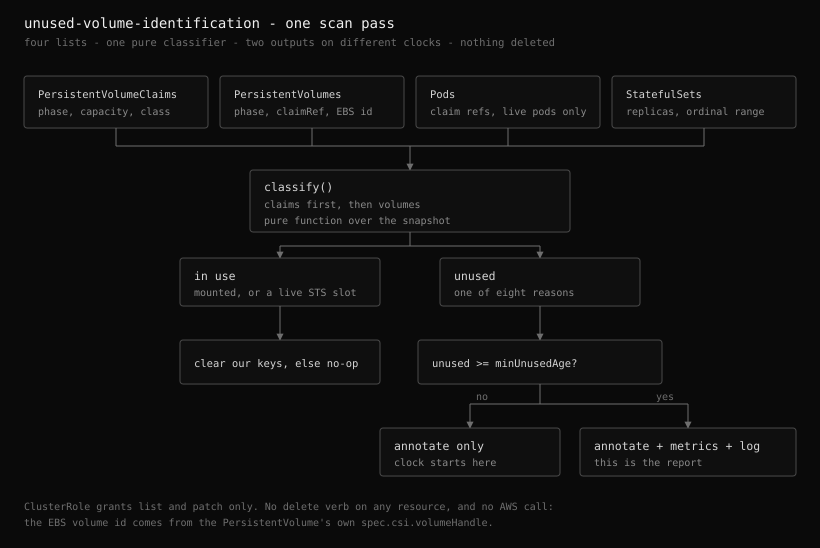

# Unused volume identification

Status: implemented, always on, no configuration surface

A cluster leaks storage in a way nothing tells you about. A Deployment is
deleted and its PersistentVolumeClaim survives. A StatefulSet is scaled from six
replicas to two and Kubernetes deliberately keeps the four claims it no longer
uses. A PersistentVolume under a `Retain` reclaim policy outlives the claim that
was bound to it, and Kubernetes will never reuse it and never delete it. In each
case the EBS volume behind the object keeps billing at the full provisioned
size, and no controller in the cluster is unhappy about it.

This design adds a third loop that finds those objects and says so. It never
deletes one.

## Why identification is the whole feature

Deleting is the obvious next step and is deliberately out of scope, not
deferred.

"Unused" here is an observation about the cluster's current state: no live Pod
mounts this claim. It is not a statement about the data. A claim held for a
quarterly batch job, a StatefulSet parked at zero replicas over a holiday, a
volume kept deliberately for a restore, and a claim nobody will ever read again
are indistinguishable from inside the cluster, and no amount of extra signal
inside this addon's reach separates them. The information that separates them
lives with whoever created the workload.

Every other mutation this addon performs is triggered by a measurement. A resize
happens because `df` reported a number. A throughput piggyback rides a
modification a measurement already justified. A deletion here would be triggered
by an inference, and it would be the one action in this addon that no later pass
can undo. So the scanner's Kubernetes surface is list and patch, its ClusterRole
carries no `delete` verb on any resource, and the decision is handed to an
operator through an annotation they can read with kubectl.

The same reasoning is why the scanner touches no AWS API at all. The EBS volume
ID it reports comes from the PersistentVolume's own
`spec.csi.volumeHandle`, not from an EC2 call, so enabling the feature adds no
IAM permissions and the loop cannot reach a volume even in principle.

## Architecture



```
scan pass (1h)
  list PVCs, PVs, Pods, StatefulSets       4 paginated list calls, cluster-wide
  -> classify()                            pure function, no I/O
  -> per object: Finding{unused, reason, unusedSince, capacity, volumeID}
  -> metrics (only past minUnusedAge)
  -> annotations (from the first pass that sees it unused)
```

The pass is four list calls regardless of cluster size, for the same reason the
recommender gathers the whole cluster in four calls: per-object requests would
make cost grow with the thing being measured. Everything after the lists is a
pure function over the snapshot, which is what makes the classification testable
without a cluster.

The loop lives under the same leader election as the other two, on its own
interval. What it reports changes only when workloads are deleted, and every
finding is held back a day by the grace period anyway, so running it at the
resizer's cadence would re-list the entire cluster to reach the same answer.

Claims are classified before volumes, because a bound volume's verdict depends
on its claim's. Deciding that twice from different data would let the two
disagree in the report.

## What counts as unused

A claim is unused when no live Pod mounts it. Two refinements carry most of the
signal, and both exist because the naive rule is wrong in a way that matters.

**Terminal Pods are not consumers.** A `Succeeded` or `Failed` Pod object
outlives its run by however long it takes something to reap it, and it mounts
nothing. Counting it would hide the claim of every finished Job, which is a
large share of exactly the population this loop exists to surface.

**A StatefulSet replica slot is a consumer, even with no Pod.** There is no Pod
between a delete and the next schedule, and every rolling update passes through
that gap. A pass landing mid-update would otherwise report the entire
StatefulSet. So a `volumeClaimTemplate` claim whose ordinal is inside
`[spec.ordinals.start, start+replicas)` is in use with or without a Pod.

The inverse is the most valuable finding in the report. A claim whose ordinal is
*outside* that range is a scale-down leftover: Kubernetes keeps it on purpose so
scaling back up reattaches the same data, nothing ever complains, and it is the
leak that survives longest unnoticed. It is reported as
`statefulset_scaled_down` rather than folded into `no_consumer_pod`, because the
two need different decisions from a reader.

Matching is by the generated `<template>-<statefulset>-<ordinal>` name rather
than by owner reference. The StatefulSet controller sets no owner reference on
the claims it generates, precisely so that deleting a StatefulSet leaves its
claims behind, and garbage collection would undo that. A name that starts like a
template claim but does not end in an integer ordinal (`data-pg-backup`) is an
ordinary claim, not a slot.

| Reason | Kind | What it is |
|--------|------|------------|
| `no_consumer_pod` | PVC | A bound claim no live Pod mounts |
| `statefulset_scaled_down` | PVC | A template claim outside its StatefulSet's replica range |
| `unbound` | PVC | Never bound, and no Pod to trigger binding. Costs nothing yet and nothing is coming |
| `released` | PV | Claim deleted under `Retain`. Never reused, never deleted |
| `available` | PV | Never claimed |
| `failed` | PV | Automatic reclamation failed |
| `missing_claim` | PV | Still `Bound` to a claim that does not exist, or exists with a different UID |
| `bound_to_unused_claim` | PV | Bound to a claim that is itself unused |

`missing_claim` checks the UID, not just the name, so a claim deleted and
recreated under the same name leaves the old volume reading as orphaned rather
than as bound to the new claim. An empty `claimRef` UID means the volume was
pre-bound by hand rather than by the binder, so a name match is all the evidence
there is and the UID comparison is skipped.

A volume bound to an unused claim is reported separately from the claim, rather
than deduplicated into it, for two reasons: a report filtered to volumes is then
complete on its own, and the capacity is counted where it is actually
provisioned. The cost of that choice is that summing both kinds double counts,
which is why the metrics doc's total query excludes
`reason="bound_to_unused_claim"`.

A `Pending` volume is not unused. Provisioning is in flight, and calling it
unused would report every volume being created.

## The grace period and where its clock lives

Nothing is reported until it has been continuously unused for `minUnusedAge`
(24h by default). Most of what a single pass sees as unused is a workload
between two Pods, so a threshold below a few hours reports mostly churn.

That requires remembering when each object was first seen unused, and the
obvious place is process memory. It is the wrong one: a controller restart, a
leader failover, or a rollout would reset every clock, so on a cluster that
deploys daily nothing would ever reach a 24h threshold. The clock is therefore
persisted in the object's own `unused-since` annotation, alongside the verdict.

This inverts the usual ordering between the two outputs:

- **Annotations** are written from the first pass that sees an object unused,
  before the threshold. If they waited, the clock would never start.
- **Metrics and info logs** wait for the threshold. They are the report.

An unparseable timestamp, or one in the future, restarts the clock at now: a
clock that ran backwards would otherwise hold an object below the threshold
indefinitely.

An object that comes back into use has every key removed on the next pass. That
matters more here than for an advisory annotation: a stale "unused" mark on a
live claim is an invitation to delete live data.

`unused-observed-at` is excluded from the change comparison and rewritten only
when a value changed or 24h have passed. Without that exclusion every object
would be patched on every pass. Without the refresh, an object unused for months
would carry the timestamp of the day it was first marked, and a reader could not
tell a current reading from a stopped scanner. In-use objects that carry none of
these keys are skipped entirely, so a healthy cluster issues no writes at all.

`unused-days` is derivable from `unused-since`, but only outside kubectl:
`custom-columns` cannot subtract two timestamps. Writing it is what makes a
cluster's claims sortable by how long they have been dead.

## Observability

- `external_ebs_autoresizer_unused_pv_info{name,volume_id,storage_class,reason,reclaim_policy,claim_namespace,claim_name}`
  and `unused_pvc_info{namespace,name,volume_name,volume_id,storage_class,reason}`,
  both always `1`. These are the listing series: one row per reported object,
  carrying every label the report is read by. `claim_namespace` and `claim_name`
  are what let a table listed by volume name still name the workload that left
  it behind, which is the only thing that makes a `released` volume actionable.
- `external_ebs_autoresizer_unused_pv_age_seconds{name}` and `_capacity_bytes`,
  and the claim pair keyed by `{namespace,name}`. The value series carry no
  descriptive labels at all.
- `external_ebs_autoresizer_unused_objects{kind,reason}` and
  `_capacity_bytes`: the low-cardinality summary. Every known reason is
  published on every pass, including the ones that matched nothing, so a reason
  that has stopped occurring reads as `0` rather than as no data. This is the
  series to alert on. The per-object gauges carry a name label and are too wide
  for a rule.
- `external_ebs_autoresizer_unused_scan_total`: pass starts, the loop's
  liveness signal.
- Kubernetes Events on the object itself, covered below.

Identity and measurement are separate series on purpose. A series identity that
includes `reason` restarts whenever the reason changes, so a range query over an
object's age would break exactly when something about it changed, which is when
the history matters most. Keyed by name alone, the age series stays continuous
for as long as the object is unused, and the descriptive labels are written once
rather than duplicated across three metrics. The cost is one `group_left` to
build a full table, which is the standard Prometheus `_info` shape and what
Grafana's table panel expects.

The per-object gauges are cleared at the start of every pass. Objects here are
deleted precisely because somebody acted on this report, and without the reset a
deleted claim's last reading would stay exported forever and read as one still
waiting to be cleaned up. The reset runs before the loop rather than after, so a
pass that aborts partway leaves the gauges holding only what it observed, never
a mix of two passes.

Capacity is on every finding because it is what turns a list of names into a
number of GiB. A claim's capacity is read from `status.capacity` (what it bound
to, which is what bills) and falls back to `spec.resources.requests` for a claim
that never bound.

## Why there is nothing to configure

The scanner is always on and has no settings. `Interval` (1 hour) and
`MinUnusedAge` (24 hours) are constants in the package, every namespace is in
scope, and the rest of the behavior is fixed.

That is defensible here in a way it would not be for the resize loop, because of
what the loop can do. It never mutates a claim or a volume. Its cost is four list
calls an hour regardless of cluster size. Its output is advisory, and an operator
who disagrees with a finding can ignore it at no cost. There is no failure mode a
knob would protect against, so every knob would only be a way to configure the
scan into reporting nothing, which is the same argument that emptied the
recommender's config block.

A namespace filter is the one that looks most defensible and is the one worth
naming explicitly. It would change which objects the report covers rather than
how each one is judged, and a report an operator has to remember they narrowed is
worse than a longer one they can filter in the query. Every consumer of this
output (PromQL, the CLI table, kubectl on the annotation) filters by namespace
trivially.

The cost of having no config file keys is that an operator reading the mounted
ConfigMap finds nothing about the scanner at all. The startup logs make up for
it: the loop prints its effective values, its scope, what it reads, and what it
writes, on every boot.

The one global switch it does honor is `dryRun`, which suppresses the annotations
and the Events. Reading the cluster is not a mutation, so the scan still runs and
still reports under it.

## Kubernetes Events

The verdict is published a second time as an Event against the object itself, so
it is visible in `kubectl describe pvc` next to whatever else happened to that
claim.

A finding is a standing state rather than something that happens, which is the
usual argument against modelling it as an Event. Two properties of client-go's
recorder make it work anyway. Repeating the same reason for the same object does
not create a new Event: the recorder aggregates it into the existing one and
raises its count, so republishing a finding on every pass costs one Event object
per finding rather than one per pass. And republishing is exactly what a standing
state needs, because the API server expires Events after `--event-ttl`.

So the two moments are shaped differently. `UnusedVolumeDetected` is republished
every pass for as long as the finding stands. `UnusedVolumeCleared` fires once,
on the pass that erases the mark, and only when that pass actually erased
something: a claim that never carried a mark has no transition to report.

Both are `Normal`. A `Warning` on every unused claim in a cluster would drown the
Warnings that mean something is failing, and nothing about the object is broken.

The residual sharp edge is that `--event-ttl` defaults to one hour and so does
`interval`, so the standing Event can lapse briefly between passes. Lowering
`interval` closes the gap. The annotation and the metrics do not expire, and they
are the durable record.

## Why not an admission webhook or a CRD

An admission webhook would catch the workload deletion that orphans a claim, at
the moment it happens, with no polling. It would also miss every claim orphaned
before it was installed, which on a real cluster is the entire backlog the
feature exists to find, and it would put this addon in the request path of every
delete in the cluster. A periodic full scan has neither problem and its cost is
four list calls an hour.

A CRD holding the report would survive restarts, be queryable, and keep history.
It would also make this a second controller with its own object lifecycle,
install ordering, and upgrade story. The annotation and the metric cover reading
the current state, which is the whole feature. When apply history or a
per-object workflow is needed, that is the signal to add a CRD, not to grow the
annotation schema.

## What this deliberately does not do

- **No deletion, and no permission to delete.** Covered above. This is the
  feature's defining constraint, not a phase one.
- **No EBS volumes without a PersistentVolume.** A volume whose PV was deleted
  under `Retain` is invisible here: there is no Kubernetes object left to
  classify. Finding those means an EC2 `DescribeVolumes` sweep filtered on the
  `kubernetes.io/created-for/pvc/*` tags, which is a different data source, a
  different permission set, and arguably a different addon.
- **No configuration at all.** There is no enable switch, no interval, no
  threshold, and no namespace filter. See below.
- **No alerting integration.** Alertmanager here is wired to resize outcomes,
  which are events with a start and an end. A count of unused volumes is a
  gauge someone should threshold in their own alerting rules, and
  `unused_objects` exists for exactly that.
