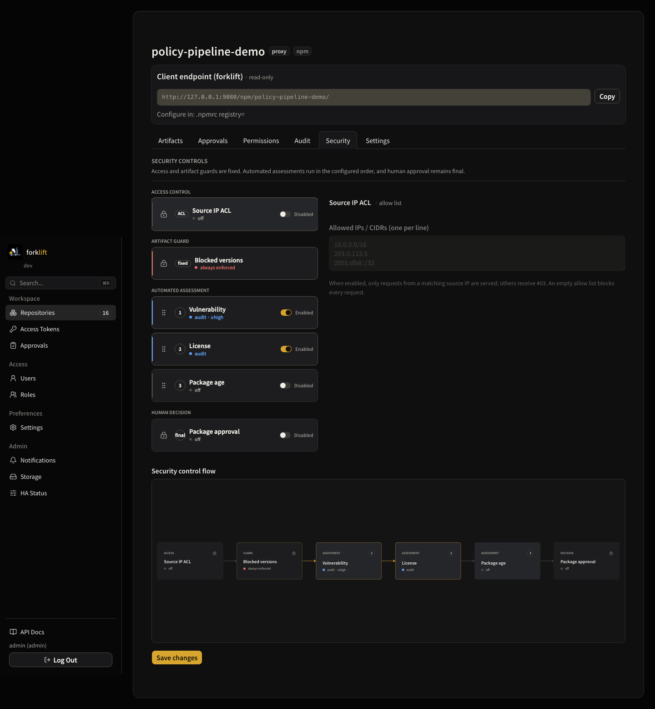

# forklift

[](https://www.rust-lang.org/)
[](https://github.com/younsl/addons/pkgs/container/forklift)
[](https://github.com/younsl/addons/pkgs/container/charts%2Fforklift)
[](https://github.com/younsl/addons/blob/main/LICENSE)

Lightweight, Kubernetes-native artifact repository: one static Rust binary that hosts and proxies Maven, npm, Cargo, Go module, PyPI and OCI (container image / Helm chart) artifacts, with a React UI, OIDC login and supply-chain policy gates. A focused alternative to heavyweight JVM-based repository managers.


| | |
|---|---|
| Formats | Maven (and Gradle), npm, Cargo, Go Modules, PyPI, OCI (container images and Helm charts) |
| Repository types | Hosted, Proxy (cached upstream), Group (one URL, ordered member lookup) |
| Storage | Content-addressed blobs (SHA-256 dedup) on a PV or S3, metadata in embedded SQLite |
| Auth | Keycloak OIDC with group-to-role mapping, local accounts, scoped access tokens ([docs](docs/access-control.md)) |
| Supply chain | Age policy, package approval, version denies, OSV vulnerabilities, deps.dev licenses ([docs](docs/security-policies.md)) |
| Publishing | Native `npm publish` / Twine / Maven PUT, plus atomic UI and API upload for every format ([docs](docs/usage.md#managed-artifact-upload)) |
| HA | Lease leader election on an RWX volume, PV-based replication, or S3 ([docs](docs/architecture.md)) |
| Ops | Static musl scratch image (linux/amd64, linux/arm64), Prometheus metrics ([docs](docs/metrics.md)), per-repository audit log, OpenAPI 3.1 docs, MCP server ([docs](docs/mcp.md)) |

## Supply-chain gates

Every proxy request passes an ordered pipeline, configured per repository on the Security tab:



## Quick start

```bash
helm install forklift oci://ghcr.io/younsl/charts/forklift \
  --namespace forklift --create-namespace \
  --set persistence.storageClass=efs-sc \
  --set auth.bootstrap.adminPassword=change-me
```

The default `replicaCount: 2` needs a ReadWriteMany volume; without RWX storage use PV-based replication or the S3 backend ([docs](docs/installation.md)). Then point a client at a repository, e.g. `registry=http://forklift/npm/npm-public/`.

## Documentation

Everything below lives in [docs/](docs/), ordered from getting forklift running to how it is built and tested.

- [Installation](docs/installation.md): chart install for the three storage layouts, S3/IRSA setup, chart versions
- [Configuration](docs/configuration.md): every `FORKLIFT_*` environment variable and its default
- [Architecture](docs/architecture.md): process layout, HA modes, failover and data-loss windows
- [Usage](docs/usage.md): creating repositories, client wiring, group repositories, artifact upload
- [Access control](docs/access-control.md): roles, actions, OIDC group mapping, declarative RBAC, token scopes
- [Security policies](docs/security-policies.md): approval, version denies, vulnerability (OSV) and license (deps.dev) gates
- [License scanning](docs/license-scanning.md): end-to-end license workflow and UI surfaces
- [Coverage](docs/coverage.md): measuring how much of your GitLab actually builds through forklift, and the report that names what is left
- [Metrics](docs/metrics.md): per-metric meaning, labels, example PromQL queries
- [MCP server](docs/mcp.md): running `forklift-mcp` and wiring agent runtimes to it
- [Development](docs/development.md): make targets, frontend build, design documents, release flow
- [Browser tests](docs/testing/e2e-plan.md): what the Playwright suite covers, how it runs against a real server
- [`data-testid` convention](docs/testing/testid-convention.md): naming rules for the handles the browser tests select on

## Talks

- [forklift: Go에서 Rust로](docs/slides/2026/forklift-rust-porting/slides.pdf) (2026-09-10): porting the runtime one-to-one from Go to Rust, and what it did to leader-pod memory, image size and resource requests ([HTML](docs/slides/2026/forklift-rust-porting/index.html))

## License

This repository is licensed under the Apache License 2.0. See the [LICENSE](LICENSE) file for details.
