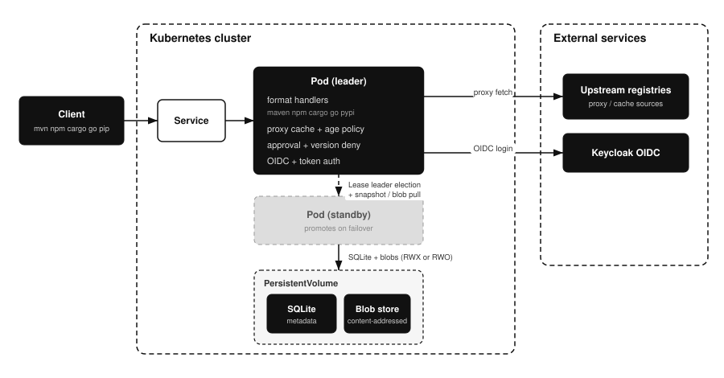

# Architecture

## Overview

This document describes how forklift is put together at runtime: the one
process, where artifact bytes and metadata live, and how the three
high-availability layouts differ in failover behavior and data-loss window.

Read this when choosing a storage layout, when reasoning about what a failover
costs, or before changing anything about how the pods are deployed.

## Background

An artifact repository has to serve several package protocols over HTTP, hold
large immutable files, and keep a consistent index of what it has. forklift does
all of it in a single static Rust binary: the format handlers, the proxy cache and
policy gates, the management API, and the embedded
[React](https://github.com/facebook/react) UI are one process.

Two properties drive the rest of the design. Artifact bytes are content
addressed by SHA-256, so identical files are stored once and any pod can read or
write them without coordination. Metadata lives in embedded
[SQLite](https://github.com/sqlite/sqlite), which accepts exactly one writer, so
a multi-replica install must guarantee there is never more than one. A
[Kubernetes](https://github.com/kubernetes/kubernetes) Lease provides that
guarantee by electing a leader, and the storage layouts below differ mainly in
how the standby gets a copy of the leader's state.

forklift runs as one process serving everything on port 8080 (metrics on 8081):



- A content-addressed blob store on a PersistentVolume holds artifact bytes (deduplicated by SHA-256).
- Embedded SQLite holds metadata: repositories, the artifact index, users, roles, and tokens.
- Package-format handlers translate each ecosystem's native protocol into blob store and metadata operations.

## High availability

For HA, a Kubernetes Lease elects a single leader; only the leader serves traffic and writes to SQLite, which keeps a single writer. The standby takes over on failover. Three storage layouts are supported:

- Shared volume (default): both pods mount one ReadWriteMany volume; only the leader is Ready, so the Service routes to it.
- PV-based replication (`replication.enabled=true`): each pod owns a ReadWriteOnce volume; the standby pulls the leader's SQLite snapshot and blobs every interval over token-authenticated internal endpoints and promotes that copy when it wins the election. Traffic follows the `forklift.io/role=leader` pod label. Replication is asynchronous, so writes within one interval can be lost on failover.
- S3 backend (`storage.backend=s3`): blobs live directly in a shared S3 bucket (content-addressed and immutable, so every pod reads and writes it safely with no coordination), and the leader snapshots the SQLite database to S3 each interval while standbys restore it on promotion. Pods run as a Deployment with only an `emptyDir` for the live SQLite working file, so no EBS or RWX volume is needed. Metadata replication is asynchronous, so writes within one interval can be lost on failover. Mutually exclusive with PV-based replication.

```
shared RWX volume mode:
client (mvn/npm/cargo/go/pip)  ->  Service  ->  leader pod
                                              |- format handler (maven/npm/cargo/go/pypi)
                                              |- proxy cache + age policy
                                              |- SQLite metadata      (RWX PV)
                                              '- content-addressed blobs (RWX PV)

PV-based replication mode (StatefulSet):
client  ->  Service (role=leader)  ->  leader pod   [SQLite + blobs on own RWO PV]
                                            ^
                                            | pull snapshot + blobs every interval
                                       standby pod  [own RWO PV, promotes on failover]

S3 backend mode (Deployment, emptyDir only):
client  ->  Service  ->  leader pod ---- blobs (read/write) ----> S3 bucket
                              |          metadata snapshot up ---^   |
                         standby pod  <-- metadata snapshot down ----'
                         (restores snapshot, promotes on failover)
```

A split into separate frontend and backend pods has been considered and is not implemented; see [designs/fe-be-pod-split.md](designs/fe-be-pod-split.md).

## Related documents

- [Installation](installation.md) for choosing a storage layout at install time.
- [Metrics](metrics.md) for leader election, replication and S3 snapshot metrics.
