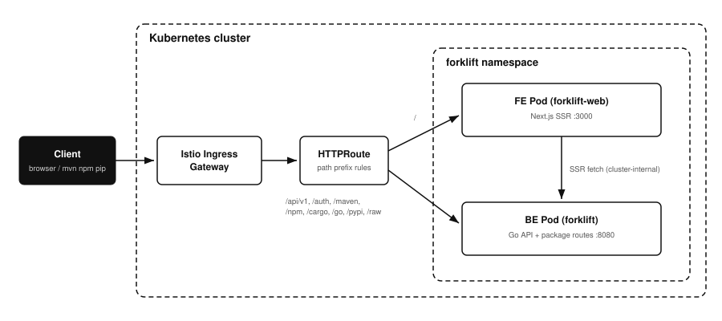

# Frontend/backend pod split with HTTPRoute path routing

## Status

**Implementation status: Not implemented.** Verified on 2026-08-16 against
`main` commit `5db514b`, and still accurate after the Rust port. Forklift ships
as a single pod: the SPA is embedded with `rust-embed` in `src/webui.rs` and
served through the fallback handler wired in `src/bin/forklift.rs`. There is no
separate frontend image and no HTTPRoute path split.

Proposed. This document describes splitting the single forklift pod into a
Next.js SSR frontend pod and a backend pod, with a [Gateway
API](https://github.com/kubernetes-sigs/gateway-api) HTTPRoute routing by path
prefix. Nothing in this document is implemented yet.

## Overview

This design proposes splitting the single forklift pod into a separate frontend
pod and backend pod, routed by path prefix with a Gateway API HTTPRoute. It
records the motivation, the routing table, and the trade-offs against the
current single-binary deployment.

Read this when evaluating whether the split is worth taking on. Nothing here is
implemented.

## Context

Forklift ships as one container image and one pod. The binary embeds the
[Vite](https://github.com/vitejs/vite)-built
[React](https://github.com/facebook/react) SPA (`src/webui` via `rust-embed`)
and serves everything on port 8080:

- `/api/v1/*` — management API (`src/api`, mounted in
  `src/bin/forklift.rs`).
- `/maven|/npm|/cargo|/go|/pypi|/raw` — package format routes
  (`src/repo/router.rs`).
- `/auth/login`, `/auth/callback` — public OIDC endpoints.
- `/openapi.yaml`, `/api-docs` — spec and [Scalar](https://github.com/scalar/scalar) docs UI.
- `/internal/replication/*` — HA replication source.
- Everything else — the embedded SPA with a history-API fallback
  (`srv.Router().NotFound(webui.Handler())`).

Port 8081 serves `/metrics` and health probes separately and is unaffected.

The primary problem is scaling. Frontend and backend load profiles are
independent and spike independently, but the single pod forces them to scale
as one unit:

- Package traffic (CI fleets hammering `/maven`, `/npm`, `/go` during build
  storms) is I/O-bound on upstream proxies and object storage. UI traffic
  (console sessions, SSR rendering) is CPU-bound per request. A spike in one
  currently forces scaling replicas sized for both, wasting the other's
  headroom.
- Scaling the monolith horizontally for UI load multiplies backend-side
  costs that should not multiply: cache-engine memory, object-storage
  connections, and (in HA mode) leader-election churn.
- One overload domain: heavy SSR or bundle-serving load competes for the same
  pod's CPU as in-flight package downloads, so a UI traffic burst can degrade
  package serving and vice versa.

Splitting lets each tier get its own replica count, resource requests, HPA
policy, and PodDisruptionBudget, sized to its own load signal.

Secondary problems the split also fixes:

- A UI-only change rebuilds and redeploys the whole binary, restarting the
  cache engine and interrupting in-flight package downloads.
- The SPA renders client-side only: first paint requires downloading the full
  bundle, and pages cannot be server-rendered for faster loads or for
  crawlable content (artifact browse pages, docs).
- The frontend release cadence is chained to the backend release cadence.

## Goals

- Scale frontend and backend independently: each tier gets its own replica
  count, resource requests, HPA target, and PodDisruptionBudget so an
  overload in one tier is absorbed by scaling that tier alone.
- Serve the UI from a dedicated Next.js SSR pod; serve the API and package
  routes from the existing Rust pod with the embedded SPA removed.
- Route by path prefix at the Gateway API layer (HTTPRoute), keeping a single
  external hostname so the session cookie (`forklift_session`, `Path=/`,
  `HttpOnly`) continues to work without CORS or cookie-domain changes.
- Keep every package-client-facing URL byte-identical: `mvn`, `npm`, `cargo`,
  `go`, `pip`, and `twine` configurations must not change.
- Allow independent image builds and releases for frontend and backend.
- Preserve the existing single-pod deployment as a supported mode until the
  split is proven (the chart must render either topology).

## Non-goals

- Changing authentication: the backend keeps issuing and validating the
  signed session cookie; the frontend never mints sessions.
- Moving any API or policy logic into the Next.js server. The frontend is a
  rendering layer only.
- Introducing a BFF/GraphQL layer or changing the `/api/v1` contract.
- Ingress support for the split topology (HTTPRoute only; the existing
  `ingress.yaml` remains single-backend).
- CDN or edge caching for SSR output.

## Architecture



### Path routing

Gateway API matches the most specific path first, so the frontend takes a `/`
catch-all and the backend claims explicit prefixes:

| Path prefix | Backend | Notes |
|---|---|---|
| `/api/v1` | backend | Management API |
| `/auth` | backend | OIDC login/callback set cookies on the shared hostname |
| `/maven`, `/npm`, `/cargo`, `/go`, `/pypi`, `/raw` | backend | Package clients; URLs unchanged |
| `/openapi.yaml`, `/api-docs` | backend | `Exact` match type |
| `/internal/replication` | backend | HA replication (consider restricting at the Gateway) |
| `/` | frontend | SSR pages, Next.js static assets (`/_next/*`) |

The Cargo sparse index builds absolute download URLs from
`X-Forwarded-Host`/`X-Forwarded-Proto` (`src/repo/cargo.rs`); the Gateway
implementation must forward these headers to the backend as the current
ingress does.

### Frontend pod

- Next.js in `standalone` output mode, `node:24-alpine`-built, distroless or
  alpine runtime, non-root, port 3000.
- Server-side data fetching goes to the backend cluster-internally via
  `BACKEND_URL` (the backend Service DNS name), forwarding the incoming
  `Cookie` header so SSR renders authenticated state. Client-side fetches keep
  using relative `/api/v1` paths through the Gateway — the generated TanStack
  Query client (`web/src/generated`) already uses relative paths.
- Health: `/api/healthz` route handler for liveness/readiness.
- The pod is stateless; HPA on CPU is sufficient.

### Backend pod

- The existing binary minus the SPA: remove `src/webui`, the `web` build
  stage in `Dockerfile`, and the `NotFound(webui.Handler())` mount. `NotFound`
  reverts to a plain 404 JSON response.
- Everything else (config, HA leader election, metrics on 8081, PVC/S3
  storage) is unchanged.

### SPA to SSR migration

This is the dominant cost. The current UI is TanStack Router + TanStack Query +
[shadcn](https://github.com/shadcn-ui/ui) on Vite; Next.js uses file-based App
Router routing. The migration is a route-by-route port, not a lift-and-shift:

- Components, hooks, and the generated OpenAPI query client port unchanged.
- TanStack Router route definitions become App Router directories; loaders
  become server components or route-level `fetch`.
- Vitest/Playwright suites need config-level changes only; Storybook keeps
  running against components.

An intermediate step that de-risks the schedule: ship phase 1 with the
existing Vite SPA served from a static nginx (or `next start` in SPA mode)
frontend pod, proving the HTTPRoute split and release decoupling first, then
port to SSR route by route. The routing and chart work below is identical
either way.

## Build and release

Two images from two Dockerfiles, released independently:

| Image | Source | Trigger |
|---|---|---|
| `forklift` (backend) | root `Dockerfile`, web stage removed | existing label-driven release |
| `forklift-web` (frontend) | `web/Dockerfile` | same mechanism, own version label |

The backend image stays `FROM scratch`. Versions are decoupled: the UI can
ship daily without touching the cache engine. The API contract boundary is
the OpenAPI spec (`src/openapi/openapi.yaml`); the frontend build pins
the spec version it generated its client from, and CI fails the frontend
build if the deployed backend's `/api/v1` version reports an older spec than
the client requires.

## Helm chart changes

`charts/forklift` gains a `web` block; `gateway.rules` defaults change from a
single `/` rule to the split table above when `web.enabled=true`:

```yaml
web:
  enabled: false          # off = current single-pod topology, unchanged rendering
  image:
    repository: ghcr.io/younsl/forklift-web
    tag: ""
  replicaCount: 2
  autoscaling:
    enabled: false        # HPA on CPU; frontend is stateless so scale freely
    minReplicas: 2
    maxReplicas: 10
    targetCPUUtilizationPercentage: 70
  service:
    port: 3000
  env:
    backendURL: ""        # defaults to the chart's backend Service DNS name
```

- New templates: `deployment-web.yaml`, `service-web.yaml`; `httproute.yaml`
  is already fully rule-driven from values, so only `values.yaml` defaults
  change.
- `web.enabled=false` must render exactly today's manifests (golden-file test
  in the chart CI).
- PodDisruptionBudget and ServiceMonitor apply to the backend only; the
  frontend gets its own PDB when `web.replicaCount > 1`.

## Rollout plan

1. Chart: add `web.*` values, templates, and split-route defaults behind
   `web.enabled` (default off). No behavior change for existing installs.
2. Frontend image: build and release the current Vite SPA in a standalone
   frontend pod; flip `web.enabled=true` in a staging install; verify OIDC
   login, package pulls, and deep-link refreshes through the Gateway.
3. Backend: remove `src/webui` and the Dockerfile web stage in the next
   minor release. Until then the embedded SPA is dead weight but harmless,
   which keeps step 2 reversible by flipping `web.enabled` back.
4. SSR: port routes to Next.js App Router incrementally; the frontend image
   swaps from static serving to `next start` with no chart or route changes.

## Risks

- **Route drift.** A new backend path prefix (like a future package format)
  that is not added to the HTTPRoute silently falls through to the frontend
  and returns an SSR 404. Mitigation: a chart test asserting every prefix in
  `src/repo/router.rs` and `src/bin/forklift.rs` mounts appears in the
  default `gateway.rules`.
- **Session semantics in SSR.** Forwarding cookies from the SSR fetch to the
  backend must not leak one user's render into another's cache; Next.js
  `fetch` caching must be disabled (`no-store`) for authenticated requests.
- **Two-image version skew.** UI built against a newer OpenAPI spec than the
  running backend. Mitigated by the spec-version gate in CI and by the
  frontend treating unknown fields as absent.
- **Gateway dependency.** The split topology requires a Gateway
  implementation; clusters using the plain Ingress cannot enable `web.*`.
  Accepted: single-pod mode remains supported for them.
