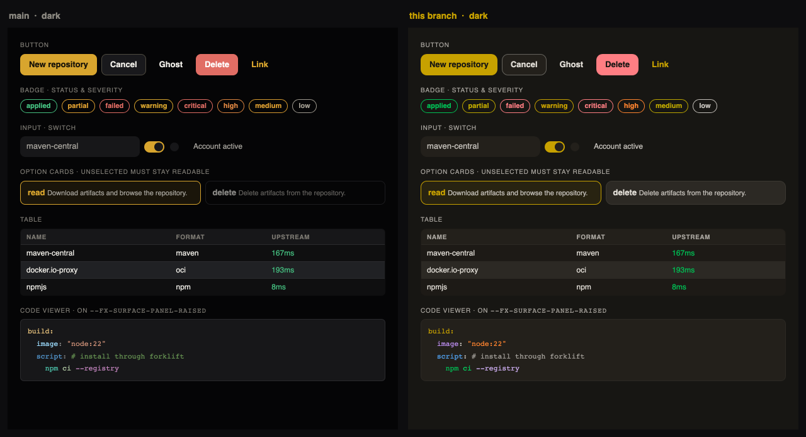
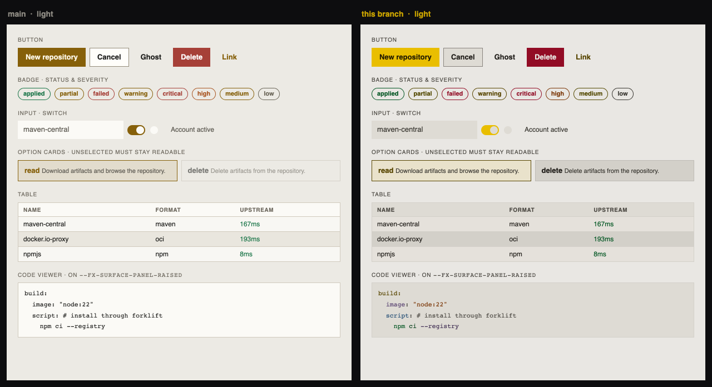
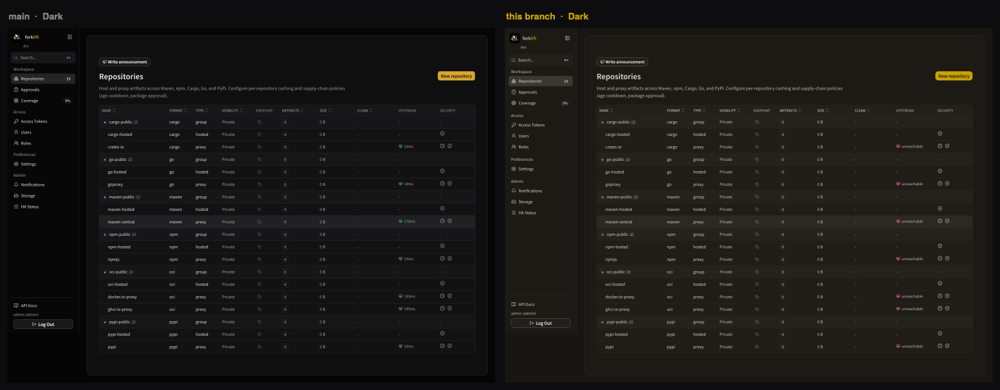
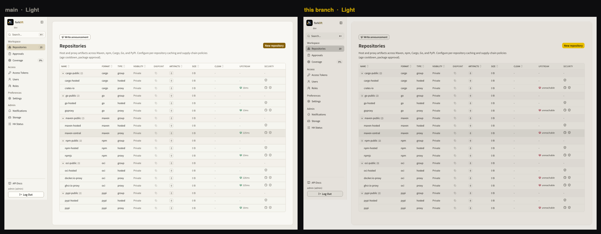
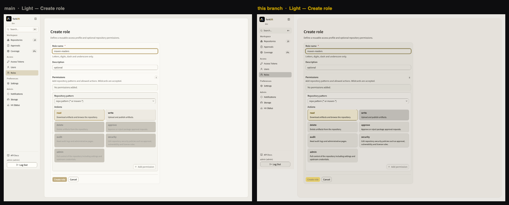
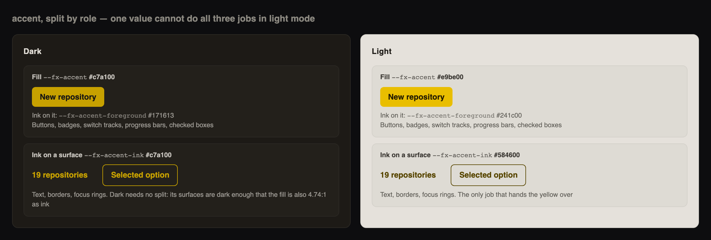

# Web Design Tokens

The canonical design tokens live in `web/src/styles/tokens.css` as CSS custom
properties. Tailwind 4 reads them through `@theme inline` in
`web/src/styles/theme.css`, so shadcn and app-ui components share the same
palette.

## Status

**Implementation status: Active convention, in effect.** Verified on 2026-08-28
against `b04378c`. This is not a proposal: every token listed below is defined in
`web/src/styles/tokens.css` and shipped in the web UI. When a token is added,
renamed, or removed in that file, update this document in the same change.

The values themselves are derived rather than chosen. How they are derived, and
what has to stay true when one changes, is in
[color-contrast-ramp.md](color-contrast-ramp.md). Read that before changing a
token's value; read this before using one.

## Overview

This document is the reference for the web UI's design tokens: what each token
means, which layer it belongs to, and which token a given visual decision
should reach for.

Read this before adding a color, surface, or radius value to a component.

## What The Tokens Produce

The same component sheet, rendered with each token set. Nothing in the markup
differs between the two sides — only the token values.





Reading these left to right is the shortest description of what the token layer
is for. The primary button, the switch and the option card change because
`--fx-accent` split into three roles. The table and the code viewer change
because the surfaces gained room to stack. The unselected option card changes
because dimming readable text with `opacity` is not a hierarchy device.

And on real screens:







## Background

Tokens exist so that a visual decision is made once and reused, rather than
re-derived as a literal in each component. forklift keeps them as CSS custom
properties, which [Tailwind](https://github.com/tailwindlabs/tailwindcss) reads
through `@theme inline`, so the app's own primitives and the
[shadcn/ui](https://github.com/shadcn-ui/ui) primitives resolve to the same
palette instead of drifting apart.

The `--fx-*` layer is the source of truth. Older aliases survive only for scoped
CSS that predates it, and theming works by redefining tokens rather than by
overriding component styles.

## File Layout

Stylesheet concerns are separated so that the file you open to change a token
holds nothing else.

| File | Holds |
| --- | --- |
| `web/src/styles.css` | Entry point. Imports only. |
| `web/src/styles/tokens.css` | The two token blocks, `:root, .dark` and `.light`. **The file to edit.** |
| `web/src/styles/theme.css` | `@theme inline` — the bridge to Tailwind and shadcn namespaces. No literal values. |
| `web/src/styles/fonts.css` | The `@font-face` declarations. |
| `web/src/styles/aliases.css` | The older `--panel`/`--text` vocabulary, the type scale, font stacks. |
| `web/src/styles/base.css` | Element defaults, keyframes, and the few component rules that cannot be utilities. |

## Token Layers

There are three, and a component should reach for the outermost one that can
express what it needs.

1. **Tailwind and shadcn semantic classes** — `bg-card`, `text-muted-foreground`,
   `border-border`, `bg-primary`, `text-accent-ink`. Preferred. These resolve
   through `theme.css` to an `--fx-*` token.
2. **`--fx-*` tokens directly** — `shadow-[var(--fx-overlay-shadow)]`,
   `bg-[var(--fx-surface-3)]`. For visuals the semantic layer cannot describe.
3. **Legacy aliases** — `--bg`, `--panel`, `--text`, `--accent`. Present only for
   scoped CSS that predates the `--fx-*` layer. Do not use in new component code.

## Color Tokens

### Surfaces

| Token | Purpose |
| --- | --- |
| `--fx-canvas` | Page background. |
| `--fx-canvas-elevated` | Slightly raised background, mostly for gradients or shell surfaces. |
| `--fx-sidebar-bg` | Sidebar background. |
| `--fx-surface-panel` | The frame the app content sits in. |
| `--fx-surface-panel-raised` | A raised region inside that frame — table headers, code blocks. |
| `--fx-surface-1` | Panels and cards. |
| `--fx-surface-2` | Muted fills, secondary controls, recessed read-only fields. |
| `--fx-surface-3` | Elevated popovers, chips that sit on a muted card, specialized visualizations. |
| `--fx-surface-hover` | Hover state for a row or a control. |
| `--fx-surface-selected` | Selected row or chip. |
| `--fx-body-gradient-start` | Top stop of the body gradient. |

### Controls and borders

| Token | Purpose |
| --- | --- |
| `--fx-input` | Input background. |
| `--fx-control` | Control background. |
| `--fx-control-hover` | Control hover background. |
| `--fx-border-subtle` | Hairline separation between panels. |
| `--fx-border` | Default border. |
| `--fx-input-border` | Input and control outline. |
| `--fx-border-strong` | Stronger outlines and dividers. |

`--fx-input-border` is a **border** token. Painting it as a solid fill produces a
mid-grey slab; shadcn only ever uses `--color-input` as a fill with an opacity
modifier. A recessed field takes `bg-muted`.

### Text

| Token | Purpose |
| --- | --- |
| `--fx-text` | Primary readable text. |
| `--fx-text-muted` | Secondary text and metadata. |
| `--fx-text-subtle` | Low emphasis labels and helper marks. |

### Accent

The accent carries three separate jobs, and one value cannot do all three in
light mode. Yellow is inherently light, so a yellow that reads as yellow can
never be 4.5:1 against a pale grey. Solving for that with a single token turns
the light accent into a dark olive and costs the brand its color.



| Token | Job | Where |
| --- | --- | --- |
| `--fx-accent` | The **fill**. Yellow in both themes. | Buttons, badges, switch tracks, progress bars, checked boxes. `bg-primary`. |
| `--fx-accent-hover`, `--fx-accent-pressed` | The fill's interaction states. In light mode these **darken**, so the ink stays legible. | |
| `--fx-accent-foreground` | The ink that sits **on** that fill. | `text-primary-foreground`. |
| `--fx-accent-ink` | The accent used **on a surface**: text, borders, focus rings. The only job that hands the yellow over, and only in light mode. | `text-accent-ink`, `border-accent-ink`, `ring-accent-ink`. |

Dark mode needs no split in practice: its surfaces are dark enough that the fill
color is also legible as ink, so `--fx-accent-ink` matches `--fx-accent` there.

Deciding between them is a single question: **is the accent the background, or is
it drawn on top of a background?** A filled control uses `--fx-accent` with
`--fx-accent-foreground` inside it. Anything drawn on a surface — a label, a
hairline, a ring — uses `--fx-accent-ink`.

### Status and severity

| Token | Purpose |
| --- | --- |
| `--fx-success`, `--fx-warning`, `--fx-danger` | Status states. |
| `--fx-danger-hover` | Danger fill hover. |
| `--fx-danger-foreground` | Ink on the danger fill. Dark, not white. |
| `--fx-info` | The third rung of the policy severity ladder, below block and warn. |
| `--fx-severity-critical`, `--fx-severity-high`, `--fx-severity-medium`, `--fx-severity-low` | Severity ladder. |

Severity in light mode must not rely on color alone: its four levels separate by
44.0 there against dark's 84.2, because light orange and light yellow converge.
A severity badge needs an icon or a word alongside the color.

### Login background

`--fx-login-glow` and `--fx-login-wave` tint the login screen's animated
background. They are the only decorative color tokens, and they exist because
that surface is allowed a background the authenticated screens are not.

### Code viewer

`--fx-code-job`, `--fx-code-keyword`, `--fx-code-key`, `--fx-code-string`,
`--fx-code-variable`, `--fx-code-literal`, `--fx-code-number`,
`--fx-code-comment`, `--fx-code-punct`, `--fx-code-hit`.

The GitLab CI viewer renders line by line so matched lines can carry their own
background, which rules out a prebuilt highlighter theme. Each theme has its own
set, drawn from the same ramp as everything else and verified against
`--fx-surface-panel-raised`, which is the surface the log actually renders on.
Do not borrow an editor theme here: an editor's colors are tuned for that
editor's background.

## Dimension Tokens

`--fx-radius-sm` (6px), `--fx-radius-md` (8px), `--fx-radius-lg` (10px),
`--fx-radius-xl` (14px), `--fx-radius-2xl` (20px).

`--fx-sidebar-width`, `--fx-content-max`, `--fx-main-gutter-x`,
`--fx-main-gutter-y`, `--fx-page-x`, `--fx-page-x-wide`, `--fx-page-y`.

`--fx-overlay-shadow`, `--fx-panel-highlight`, `--fx-focus-shadow`.

A focus ring is non-text UI and needs 3:1, which the yellow fill cannot reach on
a pale surface, so `--fx-focus-shadow` and `--color-ring` are drawn from
`--fx-accent-ink`.

## Type Scale

`--fx-text-xs` … `--fx-text-3xl` are registered in `theme.css` as Tailwind's
`--text-*` namespace. That is what lets `text-sm` follow a token instead of
Tailwind's built-in rem values, and it is why roughly 480 call sites already do
without any of them naming a token.

The paired `--text-*--line-height` defaults from Tailwind survive, because
`@theme` merges rather than replaces and they are unitless ratios.

Around 56 call sites still use arbitrary sizes (`text-[13px]`, `text-[11px]`)
that bypass this scale. They are not yet promoted to steps.

## Theme Modes

Dark mode is the default:

```html
<html>
```

Light mode is enabled by applying `.light` to the document root:

```html
<html class="light">
```

Both themes are the same ramp read from opposite ends, and every role sits on the
same step number in both. That is why the semantic names above need no
light-specific remapping.

Use semantic Tailwind colors where possible:

```tsx
<section className="border border-border bg-card text-card-foreground" />
<span className="text-muted-foreground" />
<button className="bg-primary text-primary-foreground" />
<a className="text-accent-ink" />
```

Use direct tokens only for visuals that semantic colors cannot describe:

```tsx
<div className="shadow-[var(--fx-overlay-shadow)]" />
```

## Contribution Rules

- Add a token or component variant before scattering new color values.
- Do not invent a hex value. Take a step from the ramp — see
  [color-contrast-ramp.md](color-contrast-ramp.md).
- Keep both dark and light values when adding a new `--fx-*` token, on the same
  step in each.
- Never use a fill token as ink, or a border token as a fill. `bg-primary` is the
  yellow fill; `text-accent-ink` is the accent as text; `--fx-input-border`
  outlines a control and does not fill it.
- Do not dim text with `opacity` to create hierarchy. Use a quieter token.
  `opacity` is for disabled and transient states, which WCAG exempts; a
  selectable option that has to be read is neither.
- Do not add global CSS classes for route or component styling. Use Tailwind
  utilities, shadcn/app-ui variants, or a local component instead.
- Keep each file in `web/src/styles/` to its own concern, as listed above.
- Do not use `--fx-accent` for ordinary hover states or passive decoration.
- Do not add gradients to authenticated app screens unless the design document
  explicitly allows the surface.
