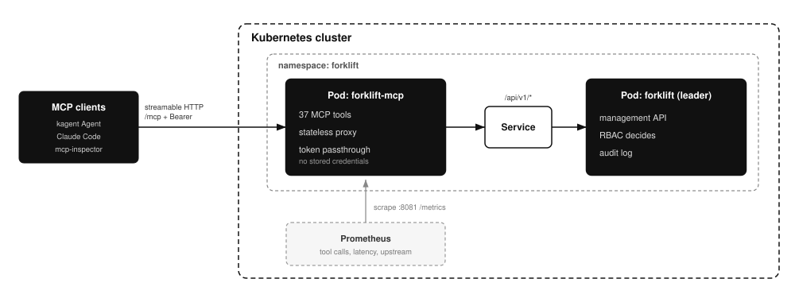

# MCP server

## Overview

forklift-mcp is a Model Context Protocol (MCP) server that exposes the
forklift management API as tools for AI agent runtimes such as Claude and
kagent. It ships as its own container image (`ghcr.io/younsl/forklift-mcp`,
released independently of forklift) and runs as its own pod, proxying every
tool call to the forklift management API over HTTP.

Read this if you want an agent to operate forklift: browse repositories and
artifacts, work the package approval queue, manage version denies, users,
roles and tokens, read audit logs, or check storage and HA status.

It is fully compatible with the [kagent](https://github.com/kagent-dev/kagent)
project: because forklift-mcp runs in-cluster and speaks MCP streamable HTTP
with per-request header auth, kagent consumes it directly as a `RemoteMCPServer`
with `protocol: STREAMABLE_HTTP`, with no adapter, sidecar or gateway in
between. See [Connecting from kagent](#connecting-from-kagent).

## Background

The [Model Context Protocol](https://github.com/modelcontextprotocol) gives an
agent runtime a uniform way to discover and call tools. A server publishes a
tool list; the client decides when to call them. forklift-mcp is such a server,
and its tools are one-to-one with the forklift management API.

Two design choices follow from that. The server is a proxy, not a second copy of
forklift: it stores nothing and every tool call becomes exactly one API request,
so an agent can never see state the API would not have returned. And it carries
no identity of its own; the caller's credential is forwarded, so the same RBAC
rules that govern a human in the UI govern an agent, and the audit log records
who actually acted.

The transport is MCP streamable HTTP, which is a plain HTTP endpoint rather than
a stdio pipe. That is what allows forklift-mcp to run as an ordinary in-cluster
Deployment and to be consumed by remote clients such as
[kagent](https://github.com/kagent-dev/kagent).

## Architecture



- Transport is MCP streamable HTTP on port 8080 at path `/mcp`.
- The server holds no state and no credentials of its own. Each tool call
  becomes one management-API request.
- Authentication is per caller: the `Authorization` header of the incoming
  MCP request (a forklift personal access token as `Bearer`, or Basic auth)
  is forwarded verbatim, so forklift RBAC decides what each caller may do.
  `FORKLIFT_MCP_TOKEN` sets an optional fallback credential for clients that
  cannot attach headers.

## Tools

The full admin surface of `/api/v1` is covered, 70 tools in total:

| Group | Tools |
|-------|-------|
| Meta | `forklift_version`, `forklift_whoami`, `forklift_search`, `forklift_get_landing_stats`, `forklift_list_repository_names` |
| Repositories | list, get, create, update, delete, set disabled, update security policy, upstream health, alarm preview, upload session state, who can access (permissions, tokens) |
| Artifacts | `forklift_list_artifacts`, `forklift_delete_artifacts`, `forklift_bulk_delete_artifacts`, `forklift_bulk_label_artifacts`, `forklift_list_audit_logs`, `forklift_list_artifact_labels`, `forklift_list_dangling_artifacts`, `forklift_list_oci_tags`, `forklift_get_oci_detail` |
| Approvals | list, count, pending repos, get, approve, reject, approve all, create (pre-approve) |
| Version denies | list, create, delete |
| Users and roles | users CRUD, roles CRUD, group mappings CRUD, user token list/create/revoke, own token list |
| Coverage | dashboard, groups, history, project detail / last commit / pipeline, mute, settings get/update, host check, GitLab check, start scan, report preview/send |
| Operations | `forklift_list_notification_receivers`, `forklift_get_announcement`, `forklift_get_storage_status`, `forklift_get_ha_status`, `forklift_ha_step_down` |

A tool call that forklift rejects (401, 403, 404, 409) returns the upstream
status and message as a tool error, so the agent can read it and adjust.

## Configuration

| Environment variable | Default | Purpose |
|----------------------|---------|---------|
| `FORKLIFT_MCP_ADDR` | `:8080` | Listen address for MCP traffic |
| `FORKLIFT_MCP_METRICS_ADDR` | `:8081` | Listen address for Prometheus metrics; always a separate listener from MCP traffic |
| `FORKLIFT_MCP_UPSTREAM_URL` | `http://localhost:8080` | forklift management API base URL |
| `FORKLIFT_MCP_TOKEN` | empty | Fallback personal access token; per-request headers win |
| `FORKLIFT_MCP_LOG_LEVEL` | `info` | debug, info, warn, error |
| `FORKLIFT_MCP_LOG_FORMAT` | `json` | json or text |

## Deploying with the chart

```bash
helm upgrade forklift oci://ghcr.io/younsl/charts/forklift \
  --namespace forklift --reuse-values \
  --set mcp.enabled=true
```

This renders a separate Deployment and Service named `<release>-mcp` from the
`ghcr.io/younsl/forklift-mcp` image. The upstream URL defaults to the
release's forklift Service; override with `mcp.upstreamURL`. To set a
fallback token, store a personal access token in a Secret and reference it:

```bash
kubectl -n forklift create secret generic forklift-mcp-token \
  --from-literal=token=forklift_pat_REPLACE_WITH_REAL_TOKEN

helm upgrade forklift oci://ghcr.io/younsl/charts/forklift \
  --namespace forklift --reuse-values \
  --set mcp.enabled=true \
  --set mcp.token.existingSecret=forklift-mcp-token
```

Keep `mcp.replicaCount` at 1 unless clients are pinned to one replica: MCP
sessions live in pod memory, so multiple replicas need session affinity.

### Exposing the endpoint outside the cluster

The MCP Service is ClusterIP, so in-cluster agent runtimes (kagent) reach it
directly. Clients outside the cluster need an entry point, and `mcp.ingress`
and `mcp.gateway` render one for the MCP Service alone, independent of the
forklift `ingress`/`gateway` values, so the MCP endpoint gets its own host
and TLS certificate:

```yaml
mcp:
  enabled: true
  gateway:
    enabled: true
    parentRefs:
      - group: gateway.networking.k8s.io
        kind: Gateway
        name: main-gateway
        namespace: gateway-system
        sectionName: https
    hostnames:
      - forklift-mcp.example.com
```

The `mcp.ingress` block mirrors the forklift Ingress values (`className`,
`annotations`, `hosts`, `tls`) and backs every path with the `<release>-mcp`
Service on `mcp.service.port`. Read the security notes below before turning
either on: the MCP layer itself is unauthenticated.

## Metrics

forklift-mcp serves [Prometheus](https://github.com/prometheus/prometheus)
metrics at `/metrics` on its own port (8081), never on the MCP traffic port.
Besides the standard process collector (`process_*`):

| Metric | Type | Labels | Meaning |
|--------|------|--------|---------|
| `forklift_mcp_tool_calls_total` | counter | `tool`, `outcome` | Tool calls. Outcome `ok`, `tool_error` (upstream rejected the call, e.g. 401/403/404) or `error` (the MCP call itself failed) |
| `forklift_mcp_tool_call_duration_seconds` | histogram | `tool` | Tool call latency including the upstream API request |
| `forklift_mcp_upstream_requests_total` | counter | `method`, `code` | Requests proxied to the forklift management API; `code` is the HTTP status, or `transport_error` when no response was received |

Scrape with the Prometheus Operator:

```bash
helm upgrade forklift oci://ghcr.io/younsl/charts/forklift \
  --namespace forklift --reuse-values \
  --set mcp.enabled=true \
  --set mcp.serviceMonitor.enabled=true
```

This renders a ServiceMonitor named `<release>-mcp` targeting the MCP
Service's `metrics` port. Useful starting queries: error ratio
`sum(rate(forklift_mcp_tool_calls_total{outcome!="ok"}[5m])) / sum(rate(forklift_mcp_tool_calls_total[5m]))`
and p95 latency
`histogram_quantile(0.95, sum by (le) (rate(forklift_mcp_tool_call_duration_seconds_bucket[5m])))`.

## Connecting from kagent

kagent is a first-class target: every forklift-mcp tool is reachable from a
kagent Agent with nothing but the manifest below. forklift-mcp speaks
streamable HTTP, so kagent connects to it with a RemoteMCPServer pointing at
the in-cluster Service, and `headersFrom` supplies the per-caller token that
forklift RBAC then evaluates:

```yaml
apiVersion: kagent.dev/v1alpha2
kind: RemoteMCPServer
metadata:
  name: forklift
  namespace: kagent
spec:
  description: forklift artifact repository admin tools
  protocol: STREAMABLE_HTTP
  url: http://forklift-mcp.forklift.svc.cluster.local/mcp
  headersFrom:
    - name: Authorization
      valueFrom:
        type: Secret
        name: forklift-mcp-credentials
        key: authorization   # value: "Bearer forklift_pat_..."
```

Then reference the server's tools from a kagent Agent as usual. Any MCP
client that supports streamable HTTP (Claude Code, Claude Desktop via a
gateway, mcp-inspector) connects the same way: URL `http://<host>/mcp`,
`Authorization` header carrying a forklift personal access token.

## Security notes

- Grant the agent a token scoped to what it should do. Read-only operation
  is a token whose scopes only allow read; the full admin tool set is only
  as powerful as the credential behind it.
- Prefer per-caller headers over `FORKLIFT_MCP_TOKEN`: with the fallback
  token every MCP client shares one identity in the audit log.
- The MCP Service is ClusterIP by default and unauthenticated at the MCP
  layer; forklift enforces auth on every proxied call. Do not expose the MCP
  endpoint on the public internet without an authenticating gateway in front.
