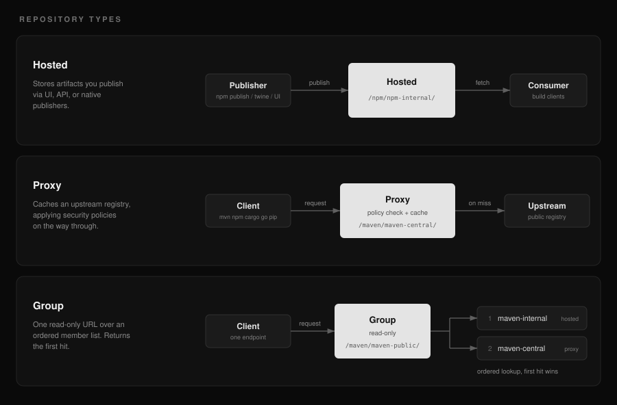

# Usage

## Overview

This document covers day-to-day operation: creating repositories, pointing each
package manager at one, how group repositories aggregate members, and how to
publish artifacts from the UI or the API.

Read this after installing forklift, or when onboarding a team onto an existing
install. Familiarity with the package manager you are wiring up is assumed.

## Background

forklift serves three kinds of repository, following the hosted / proxy / group
model established by [Sonatype Nexus Repository](https://github.com/sonatype/nexus-public).
A hosted repository stores artifacts
you publish. A proxy repository caches an upstream registry, applying the
security policies on the way through. A group repository is a read-only URL that
queries an ordered list of members and returns the first hit, so developers
configure one endpoint instead of several.



Every repository is reached at a path built from its format and name, for
example `/npm/<repo>/` or `/maven/<repo>/`, and each format speaks its own
native protocol underneath. Authentication is the same everywhere: a personal
access token used as the password, scoped to the repositories and actions the
caller needs.

## Create a repository

```bash
curl -u admin:change-me -X POST http://forklift/api/v1/repositories \
  -H 'Content-Type: application/json' \
  -d '{"name":"maven-central","format":"maven","type":"proxy",
       "upstream_url":"https://repo1.maven.org/maven2",
       "config":{"age_policy":{"enabled":true,"min_age":"3d","action":"block"}}}'
```

API reference: `http://forklift/api-docs` ([Scalar](https://github.com/scalar/scalar)) and `http://forklift/openapi.yaml`.

## Point clients at a repository

Use a personal access token as the password.

- Maven: mirror `http://forklift/maven/<repo>/` in `settings.xml`
- npm: `registry=http://forklift/npm/<repo>/` and `_authToken` in `.npmrc`
- Cargo: sparse registry `sparse+http://forklift/cargo/<repo>/` in `.cargo/config.toml`
- Go: `GOPROXY=http://forklift/go/<repo>` with a `.netrc` entry
- pip: `index-url = http://forklift/pypi/<repo>/simple/` in `pip.conf`; twine uploads POST to `http://forklift/pypi/<repo>`
- OCI: the repository name is the first segment of the image name, e.g. `docker pull forklift.example.com/oci-public/library/nginx:1.27`. Push with `docker push`, `helm push oci://forklift.example.com/oci-hosted`, or `oras push`; log in with `docker login` / `helm registry login` (an access token works as the password). containerd and CRI-O require HTTPS or an explicit insecure-registry entry.

## Group repositories

Group repositories combine hosted and proxy repositories behind one read-only URL with first-hit-wins member lookup, like the [Nexus Repository](https://github.com/sonatype/nexus-public) `maven-public` pattern. The default seed creates one per format (`maven-public`, `npm-public`, ...), so a single mirror entry such as `http://forklift/maven/maven-public/` serves both internal and upstream artifacts. Uploads still target a member repository directly.

## Managed artifact upload

UI upload is enabled by default. Users with repository `write` permission can upload Maven releases, npm tarballs, PyPI wheels/sdists, Cargo crates, and Go module ZIPs from the hosted repository page. Set `FORKLIFT_UI_UPLOAD_ENABLED=false` ([Helm](https://github.com/helm/helm): `uiUpload.enabled=false`) to opt out. Forklift validates archive metadata against the entered coordinate, commits every owned file and generated index atomically, and exposes format-specific replace/delete/yank actions only when the principal has the required permission.

Existing native publishers remain available where the ecosystem defines one: `npm publish` and Twine use the same validation/publication service as the UI. Maven's conventional multi-PUT publisher remains supported but cannot provide batch atomicity. Cargo native publish is intentionally unavailable (the sparse `config.json` omits `api`), and Go has no standard module publish command; use the UI or upload API for those formats. Group repositories remain read-only and aggregate mutable metadata across members so newly uploaded hosted versions do not hide proxy versions.

Upload limits (size, concurrency, duration) are listed in [Configuration](configuration.md); the full contract is in [designs/artifact-ui-upload.md](designs/artifact-ui-upload.md).

## Artifact labels

Any artifact can carry short operator labels, whatever its format: the identity a
label attaches to is the repository plus the stored path, so a Maven jar, a raw
file and an OCI manifest are labelled the same way. Labels are visible in the
artifacts tab, on the OCI image view, and in the sidebar search, which lists
matching labels as their own result group and also matches them when filtering a
repository's artifact table.

Adding or removing a label is allowed for an administrator on the repository and
for the principal recorded as having uploaded (or published) that artifact. A
reader who can see the artifact cannot label it, and an artifact uploaded
anonymously has no owner, so only an administrator can label it.

```bash
curl -u admin:change-me -X POST \
  http://forklift/api/v1/repositories/1/artifacts/labels \
  -H 'Content-Type: application/json' \
  -d '{"path":"com/example/app/1.0.0/app-1.0.0.jar","label":"keep-forever"}'
```

Many artifacts are labelled in one call, which is what the artifacts tab's
**Actions** menu uses. `action` is `add` or `remove`, at most 200 paths per
request, and the answer reports per path: a selection spanning artifacts somebody
else uploaded labels the ones the caller may label and returns the rest in
`failed`, rather than refusing the whole batch.

```bash
curl -u admin:change-me -X POST \
  http://forklift/api/v1/repositories/1/artifacts/labels/bulk \
  -H 'Content-Type: application/json' \
  -d '{"paths":["a/1.0.0/a-1.0.0.jar","b/2.0.0/b-2.0.0.jar"],"label":"keep-forever","action":"add"}'
```

Deleting takes the same shape at
`POST /api/v1/repositories/{id}/artifacts/bulk-delete` with a `paths` list, which
is admin-only like deleting one artifact. Both are audited per path, exactly as
the single-artifact operations are.

A label is a bare key or a `key:value` pair, each side ASCII letters, digits, `-`
and `_`, up to 64 characters in total, and one artifact holds at most 20 of them.
Surrounding whitespace is trimmed and casing is kept as typed. Every
attempt is written to the repository's audit log as `artifact.label.add` or
`artifact.label.remove`, including refused ones, with the label in the entry
detail. A label is removed with the artifact it describes.

## Related documents

- [Security policies](security-policies.md) for approval, version denies, and vulnerability/license gating.
- [Access control](access-control.md) for the permissions these operations require.
