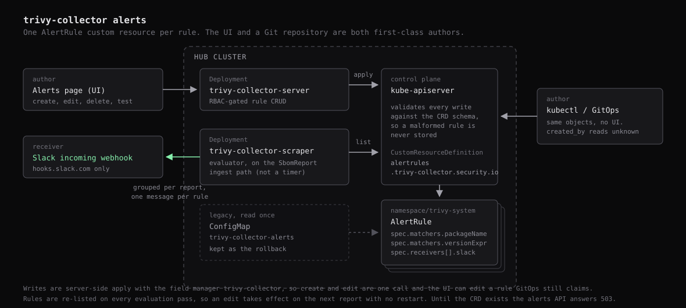

# Alerts

Alert rules fire a Slack notification when a named package lands in a workload's SBOM. Each rule is a Kubernetes object, so `kubectl get alertrules` shows exactly what the UI writes, and a rule can equally be applied from a Git repository.

**Target audience**: Platform and security engineers authoring detection rules for collected SBOM reports.



## Scope

Rules match SBOM components only. CVE and severity matching is deliberately out of scope, handled by image-registry scanning and runtime detection elsewhere. A rule answers one question: is this package, at this version, running anywhere in the fleet?

## The custom resource

| Field | Value |
|---|---|
| API group | `trivy-collector.security.io` |
| Version | `v1alpha1` |
| Kind | `AlertRule` |
| Plural | `alertrules` (short name `tcalert`, category `trivy-collector`) |
| Scope | Namespaced, in the release namespace |

```yaml
apiVersion: trivy-collector.security.io/v1alpha1
kind: AlertRule
metadata:
  name: log4shell
  namespace: trivy-system
spec:
  description: Log4Shell-affected log4j-core versions
  enabled: true
  matchers:
    packageName: log4j-core
    versionExpr: "<2.17.0"
    clusters: [prod, staging]
    namespace: payments
  labels:
    severity: critical
  annotations:
    runbook: https://wiki.example.com/log4shell
  receivers:
    - name: security-team
      slack:
        webhookUrl: https://hooks.slack.com/services/T0/B0/XXXX
        channel: "#security-alerts"
        title: Log4Shell detected
  cooldownSeconds: 3600
```

### Matchers

| Field | Absent means | Notes |
|---|---|---|
| `packageName` | match every component | Compared case-insensitively. A rule without it is legal but almost never intended |
| `versionExpr` | match any version | Comma-separated constraints, ANDed: `<2.17.0`, `>=1.0.0,<2.0.0` |
| `clusters` | match any cluster | Names as registered on the Hub |
| `namespace` | match any namespace | The *workload's* namespace, not the rule's |

### Receivers

`receivers` needs at least one entry. `slack.webhookUrl` must be on `https://hooks.slack.com/`: without that restriction a rule author could point the collector at an arbitrary internal URL and use the pod as an SSRF probe. `channel` and `title` override the webhook's defaults.

`cooldownSeconds` is the minimum gap between two notifications for the same rule and target, defaulting to 3600. `spec.labels` and `spec.annotations` are attached to the outbound message, Alertmanager-style. They are the author's labels, not the object's `metadata.labels`.

## Status

`status` is a subresource, so writing it cannot touch the spec and a GitOps controller that owns the manifest sees no drift from it. That is why the audit trail and the firing record both live here rather than in annotations: an annotation is part of the spec object, so the server recording "bob edited this" would be reverted on the next sync.

```yaml
status:
  observedGeneration: 3
  createdBy: alice@example.com
  updatedAt: "2026-02-03T04:05:06Z"
  updatedBy: bob@example.com
  lastFiredAt: "2026-09-02T09:00:00Z"
  lastFiredWorkload: prod/payments/web
  lastFindingCount: 3
  matchingWorkloads: 7
  firedCount: 12
  conditions:
    - type: Ready
      status: "True"
      reason: Validated
      lastTransitionTime: "2026-09-02T09:00:00Z"
      observedGeneration: 3
```

| Field | Meaning |
|---|---|
| `observedGeneration` | The `metadata.generation` the evaluator last acted on. Behind the current generation means the edit has not met a matching report yet |
| `createdBy` | Who created the rule through the API. Absent for one applied from Git, which reads back as `unknown` |
| `updatedAt` / `updatedBy` | The last edit through the API |
| `lastFiredAt` | When the rule last dispatched a notification |
| `lastFiredWorkload` | `cluster/namespace/name` the last notification was about |
| `lastFindingCount` | Distinct components that notification carried |
| `matchingWorkloads` | Workloads matching the rule at that firing, the fired one included. The blast radius, not a per-report count |
| `firedCount` | Notifications over the rule's lifetime. Cooldown suppression is not counted, because nothing was sent |

`created_at` in the HTTP API comes from `metadata.creationTimestamp`, not from status. The API server assigns it, so it cannot be backdated by replaying an old payload.

### Conditions

| Type | `True` | `False` |
|---|---|---|
| `Ready` | `Validated`, the evaluator will act on the rule | `Disabled`, or `InvalidVersionExpr` with the parse error in `message` |
| `Delivered` | `Delivered`, the last dispatch reached Slack | `DeliveryFailed`, with the receiver and error in `message` |

`Ready` says whether the evaluator will act on the rule, not whether it has ever matched anything. A rule watching a package nobody runs is `Ready=True` with `firedCount: 0`, which is the correct answer.

`Ready=False` is the one worth alerting on yourself. An unparseable `versionExpr` otherwise makes a rule silently inert: listed, apparently enabled, never firing.

`Ready` is answered by a watch on the rules themselves, so a new or edited rule is reported on within a watch event rather than waiting for a report. `Delivered` is absent until the rule has actually fired.

Readiness deliberately does not ride the report ingest path. Evaluation is suppressed until hydration completes, and after that a report only arrives when Trivy Operator rescans, which on a quiet fleet is hours. Tying readiness to that would leave a freshly created rule blank exactly when its author is looking at it.

`lastTransitionTime` moves only when `status` flips, not when the evaluator re-confirms it, so it answers how long the rule has been in this state.

### Who writes what

| Part | Writer | When |
|---|---|---|
| `spec` | The UI through the server pod, or kubectl / GitOps | A person edits the rule |
| `status` audit fields | server pod | Once per create or edit, right after the spec apply |
| `status` firing fields and `Delivered` | scraper pod | Only on an actual firing |
| `status.conditions[Ready]` | scraper pod | On a watch event for the rule, written only when the verdict changes |

The scraper deliberately does not write status on every ingested report. That would be one API call per rule per report, with the API server on the ingest path. It also means a single scraper replica is what makes the `firedCount` read-modify-write safe, which the chart already guarantees.

The readiness watch answers its own writes, since a status patch produces another watch event. That terminates because a status write does not bump `metadata.generation`, so the second pass finds its own verdict already recorded and writes nothing. A steady state costs no API calls.

## Evaluation

Evaluation happens on the scraper's ingest path, not on a timer.

- Only SBOM reports are considered. A vulnerability report is ignored even if delivered.
- Evaluation is suppressed until hydration completes, so a scraper rebuild does not re-fire every finding in the fleet as net-new.
- A freshly received report is diffed against the stored revision, so a rule fires on net-new components rather than on every re-list.
- Matches from one report are grouped into a single message rather than one per finding.
- Rules are reloaded from the API server on every pass, so an edit takes effect on the next report with no restart.

Each message carries an "also matches N other workloads" count, computed across the whole report store, so a recipient can tell an isolated finding from a fleet-wide one.

## Where writes go

| UI action | HTTP | Cluster effect |
|---|---|---|
| Create | `POST /api/v1/alerts` | Server-side apply creates the `AlertRule` |
| Edit | `PUT /api/v1/alerts/{name}` | Server-side apply updates it, and `creationTimestamp` is preserved |
| Delete | `DELETE /api/v1/alerts/{name}` | The object is deleted |

A create or edit is two calls: a server-side apply of the spec, then a merge patch of the status audit fields. A failure on the second is logged, not surfaced: the rule exists and will be evaluated, only its audit trail is short.

Writes use server-side apply with the field manager `trivy-collector` and `force`, so the UI can edit a rule that `kubectl apply` or a GitOps controller still claims fields on. If that is unwelcome, do not grant the UI's RBAC role `alerts:update`. See [RBAC](rbac.md).

The HTTP API is snake_case, as the rest of this API is, while the stored object is camelCase, as Kubernetes objects are. The conversion happens in one place, `src/alerts/crd.rs`.

## Preview and test

Two endpoints let an author check a rule before saving it:

- `POST /api/v1/alerts/preview` reports which workloads in the current report store match a set of matchers. It reads only reports, so it works even with no Kubernetes API access.
- `POST /api/v1/alerts/test` sends a real Slack message built from stored reports, so the operator sees what a production firing will look like rather than a mock. It returns `422` when nothing matches, because there is nothing realistic to send.

## Installing the CRD

The Helm chart ships the definition under `crds.install` (default `true`). It sits in `templates/` rather than `crds/` on purpose: Helm never upgrades anything in `crds/`, so a schema change there would silently not apply.

```yaml
crds:
  # Install and upgrade CRDs
  install: true
  # Keep CRDs on chart uninstall. Deleting the CRD deletes every rule with it
  keep: true
  annotations: {}
  additionalLabels: {}
```

Set `install: false` when the CRD is applied by something else, such as an Argo CD Application ordered ahead of this one. Until the CRD exists the alerts endpoints answer `503` with a message naming the missing resource, and the rest of the application is unaffected.

The definition is generated from the Rust type the collector reads, so it cannot drift from the code:

```bash
make crd                        # regenerate the chart template
trivy-collector crd | kubectl apply -f -   # apply it directly
```

## Migrating from the ConfigMap

Releases before this one packed every rule into a single `trivy-collector-alerts` ConfigMap. On startup the collector imports that ConfigMap's rules as `AlertRule` objects and stamps it with `trivy-collector.security.io/migrated-at`.

- Rules whose name already exists are skipped, so the import is idempotent.
- The ConfigMap is never deleted. It stays the rollback until you remove it.
- The stamp is what stops a restart from resurrecting a rule you deleted in the UI afterwards.
- A partial import is left unstamped and retried on the next start, so nothing is stranded.

Check the import, then delete the ConfigMap:

```bash
kubectl get alertrules -n trivy-system
kubectl get configmap trivy-collector-alerts -n trivy-system \
  -o jsonpath='{.metadata.annotations.trivy-collector\.security\.io/migrated-at}'
kubectl delete configmap trivy-collector-alerts -n trivy-system
```

## Operating

```bash
kubectl get alertrules -n trivy-system
kubectl get tcalert log4shell -n trivy-system -o yaml
kubectl delete alertrule log4shell -n trivy-system

# rules the evaluator refuses to act on
kubectl get alertrules -n trivy-system \
  -o jsonpath='{range .items[?(@.status.conditions[?(@.type=="Ready")].status=="False")]}{.metadata.name}{"\t"}{.status.conditions[0].message}{"\n"}{end}'
```

`kubectl get alertrules` prints `PACKAGE`, `VERSION`, `ENABLED`, `READY`, `FIRED`, `LAST-FIRED`, and `AGE`.

The webhook URL is stored in plaintext in the object, exactly as it was in the ConfigMap before. Anyone who can read `alertrules` in the release namespace can read the webhook, so scope that permission the way you would scope a Secret.
